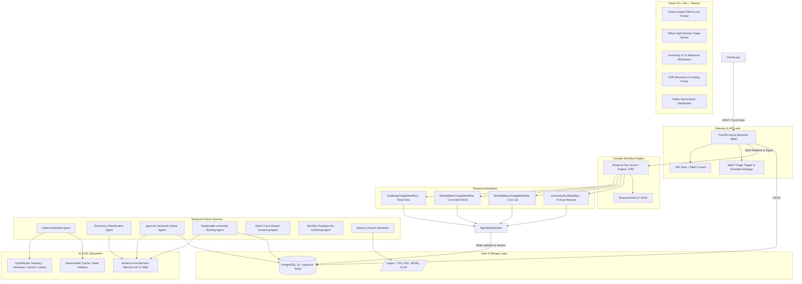

# Nitivayu — Crowdsourced Societal Challenge & Civic Innovation Pipeline

**Problem Statement ID:** SIH26043 | **Theme:** Governance & Administration | **Team:** QuantumQuest
**Region Focus:** Jharkhand, India

> **One-line pitch:** Nitivayu converts messy, multilingual citizen grievances into structured, academically-matched, CSR-funded, milestone-tracked research challenges with enforceable SLAs — *"Helplines close tickets. We solve problems."*

📖 **Companion docs:**
- `USER.md` — Complete User Manual & Operations Guide (Citizen, Officer, University, CSR, Admin workflows)
- `project_implementation.md` — Technical Implementation Blueprint & Architecture Specification

---

## Table of Contents

1. [Context & Problem](#1-context--problem)
2. [Solution Overview](#2-solution-overview)
3. [USP — Why Nitivayu Is Different](#3-usp--why-nitivayu-is-different)
4. [Features In Detail](#4-features-in-detail)
5. [How It Works — End-to-End Lifecycle](#5-how-it-works--end-to-end-lifecycle)
6. [AI Triage Engine](#6-ai-triage-engine)
7. [Durable Workflows (Temporal)](#7-durable-workflows-temporal)
8. [Architecture](#8-architecture)
9. [Tech Stack](#9-tech-stack)
10. [Data Model](#10-data-model)
11. [Backend API Reference](#11-backend-api-reference)
12. [Frontend — Pages & UX](#12-frontend--pages--ux)
13. [Output Files & Compliance](#13-output-files--compliance)
14. [Seed Data & Demo Accounts](#14-seed-data--demo-accounts)
15. [Project Structure](#15-project-structure)
16. [Setup & Run](#16-setup--run)
17. [Configuration](#17-configuration)
18. [Testing](#18-testing)
19. [Troubleshooting & FAQ](#19-troubleshooting--faq)
20. [Limitations & Roadmap](#20-limitations--roadmap)

---

## 1. Context & Problem

### 1.1 Governance gap
Traditional grievance systems (CPGRAMS, state CM helplines) are **transactional ticket registers**: they optimize for fast closure, not systemic resolution. A fluoride-contaminated handpump gets a one-line reply, not a research-backed filter.

Simultaneously:
- Jharkhand has **30+ higher-education institutions** (BIT Mesra, NIT Jamshedpur, IIT-ISM Dhanbad, CUJ, Ranchi University, XLRI, etc.) that need authentic real-world problems under **NEP 2020 experiential learning** and IIC mandates.
- Over **₹1,475 Cr in CSR funds** from mining/steel/energy PSUs and corporates remains disconnected from grassroots innovation.
- Citizen reports are **multilingual (Hindi / Hinglish / English), noisy, PII-laden, geo-imprecise, and duplicated** across villages/districts.

### 1.2 Design philosophy
**Control in Code, Judgement in AI, Accountability in Humans:**

| Principle | Implementation |
|---|---|
| **Deterministic control** | Temporal.io durable workflows own state, retries, cron, SLA timers, human signals. No lost state on crash/restart. |
| **Stochastic judgement** | OpenRouter LLMs + local multilingual embeddings confined to atomic activities with strict JSON schema + deterministic fallback cache. |
| **Human accountability** | Nodal officers approve / override / reject. Universities accept within 7-day SLA. Every decision is audit-logged. |

---

## 2. Solution Overview

Nitivayu is a **5-container Docker Compose platform**:

```
Citizen Intake (Hindi/Hinglish/English + Geo + Photo)
  → FastAPI async backend
  → Temporal durable triage (Extract → Classify/Embed → Dedup → Route)
  → Officer verification gate (72h SLA)
  → University assignment (7-day SLA, auto-reroute)
  → Student team + M1/M2/M3 milestones
  → CSR funding discovery + pledge
  → Citizen live tracking + compliance exports (CSV/PDF/JSONL/XLSX)
```

It operates on a **dual-cadence**:

1. **Real-time fast-path (<10s):** single submission → instant structuring + candidate university list + officer queue entry.
2. **Scheduled batch (Weekly Monday 00:00 + Monthly 1st):** global dedup, cross-district macro-clustering, capacity re-balancing, official CSV/PDF reports, theme-centroid refresh + CSR matching.

---

## 3. USP — Why Nitivayu Is Different

1. **Grievance → Research Challenge, not ticket:** PII-stripped LLM extraction produces `title, summary, category (10-taxonomy), severity 1-5, location_hint` — a research-ready problem, not a closed ticket.
2. **Durable execution with Temporal:** 72h officer wait + 7-day university SLA (5d + 48h warning + 2d grace) survive restarts. Workflows are visually inspectable at `:8233` — strong demo asset.
3. **Explainable routing, not black-box:** 4-factor score `0.4*theme + 0.3*semantic + 0.2*capacity + 0.1*geo` with per-match `score_breakdown` shown to officers. Spec target is `0.6/0.2/0.1/0.1`; current worker implementation uses `0.4/0.3/0.2/0.1` (see §6.4).
4. **Multilingual CPU-first AI:** `paraphrase-multilingual-MiniLM-L12-v2` (384-d, ~45ms on CPU, 120MB) handles Hindi/Hinglish/English with zero API cost; pgvector does `<15ms` ANN cosine search. OpenRouter (`nvidia/nemotron-3-ultra-550b-a55b` default, Gemini/Llama fallbacks) is wrapped with retries + `LLM_CACHE=1` offline fallback so demos work without a key.
5. **Single DB for relations + vectors:** PostgreSQL 16 + `pgvector` (`ivfflat`, `vector_cosine_ops`) avoids a separate vector DB and sync lag.
6. **Human-in-the-loop SLAs with auto-escalation:** Officer 72h → senior escalation; University 7d → auto-reroute to next-ranked university + SLA log.
7. **CSR bridge:** Industries discover `ROUTED/ACCEPTED` problems and pledge INR; monthly XLSX funding matrix maps corporate focus areas to projects.
8. **Compliance by default:** `/output/{triage,sla,reports,audit,csr}` generates BOM CSV, append-only SLA CSV, weekly PDF, immutable JSONL, monthly XLSX.
9. **Scale-ready UI:** TanStack Virtual handles 10k+ rows at 60fps; citizen bundle <40KB; keyboard shortcuts (`j/k/a/r/x`); optimistic updates; live telemetry dashboard.
10. **Continuous learning flywheel:** Monthly workflow audits officer overrides, recomputes 10 theme centroids, applies seasonal weights (monsoon water/drainage, summer fire/groundwater), refreshes embeddings without fine-tuning.

---

## 4. Features In Detail

### 4.1 Citizen — Intake & Live Tracking (`/`, `/report`, `/track/:token`)
- **Natural-language form:** Hindi / Hinglish / English textarea, District + Block dropdowns, GPS auto-detect with fallback, optional photo upload (5MB limit, `MAX_UPLOAD_BYTES`), language preference.
- **Validation:** blank → 422, >5000 chars → 422, oversize photo → 413.
- **Instant response:** `202 Accepted` with `submission_id` + human tracking token `NITIVAYU-YYYY-JH-XXXXXX`.
- **Resilience:** API creates `Submission (PENDING_TRIAGE)` + heuristic `Problem (PENDING_OFFICER_REVIEW)` + fallback `RouteAssignment` immediately, then *best-effort* starts `ChallengeTriageWorkflow`. If Temporal is down, submission still succeeds via deterministic fallback.
- **Live tracker:** timeline `Ingested → AI Triaging → Officer Review → Routed → Milestone R&D → Resolved`; shows title, category, severity, district, matched university, M1-M3 milestone list, last-10 audit activity. Public `GET /submissions/{token}/track` (no auth).
- **PII hygiene:** 10-digit phones and Aadhaar `XXXX XXXX XXXX` redacted to `[REDACTED ...]` before LLM call.

### 4.2 Nodal Officer — Triage Queue & Verification (`/officer`)
- **Auth:** JWT + RBAC (`require_role("officer","admin")`). Login is demo heuristic: `officer`/`admin` substring in email → role.
- **Queue:** `GET /officer/review-queue?skip&limit (max 100)` returns `PENDING_OFFICER_REVIEW` problems with submission join, top-3 matches, `sla_hours_remaining` (computed from first assignment deadline, default 48h).
- **Card data:** category (10-taxonomy), severity badge 1-5, district, top match + score, SLA countdown, score breakdown.
- **Actions:** `APPROVE` → `ROUTED` + assignment `OFFERED`; `OVERRIDE` (requires `override_university_id`) → re-points assignment + `match_score=1.0` + `officer_override` breakdown; `REJECT` → `REJECTED` + all assignments `CANCELLED`. Re-review → 409. Bad UUID → 422.
- **Workflow signal:** DB decision is authoritative; backend also signals running Temporal workflow (`officer_approval_signal`: `approve/reject`, OVERRIDE maps to `approve`). Signal failure only warns, never rolls back DB. Dedicated `POST /officer/reviews/{id}/signal` for explicit signaling (404 if no workflow, 502 if Temporal unreachable).
- **UX:** high-density virtualized table, search/filter by district/keyword/category/status, bulk approve, `j/k` navigate, `a` approve, `r` reject, `x` multi-select, optimistic UI with rollback.

### 4.3 Batch Admin — Cadence Control (`/officer/batch`)
- **View schedule:** `GET /admin/triage/schedules` → `{active_cadence: weekly, cron: 0 0 * * 0, next_run_utc: null}` (stub; Temporal cron is the source of truth per spec: weekly Mon 00:00, monthly 1st).
- **Trigger:** `POST /admin/triage/trigger-batch {cadence_type, include_unassigned_only}` → `{batch_workflow_id, status: STARTED, stream_url}` (starts the real `WeeklyBatchTriageWorkflow` with 7 activities on the triage-queue worker; progress streams live over SSE).
- **Spec'd batch steps:** fetch pending window → batch extract+embed → cross-district cluster/dedup → global capacity-balanced routing → triage CSV + routing PDF → officer digest notify.
- **UI:** schedule dropdown (Real-time / Daily / Weekly / Monthly), last/next run, unprocessed count, `Run Batch Triage Now` with SSE progress (Ingest → Embed → Cluster → Balance → Export).

### 4.4 University IIC — Inbox, Teams, Milestones (`/university`)
- **Workspace scoping:** login email matched exactly against `universities.nodal_contact_email`; heuristic fallback (`.ac.in`, `uni/iit/nit/prof/iic`). JWT carries `organization_id`; all inbox/project queries are scoped to it. Unlinked → 403.
- **Inbox:** `GET /university/inbox` → `OFFERED` assignments for own university, newest first: assignment_id, problem title/summary/category/severity/district/match_score/SLA.
- **Respond:** `POST /university/assignments/{id}/respond {ACCEPT|DECLINE}`. Cross-university → 403, double-answer → 409. ACCEPT → assignment `ACCEPTED` + `responded_at` + problem `ACCEPTED` + audit log.
- **SLA:** 7 days total (5d silent + warning at 48h remaining + 2d grace → auto-decline/reroute via `UniversitySLAWorkflow`; escalation activity if all decline).
- **Projects:** `GET /university/projects` → teams for own university with milestones sorted, `current_milestone` = first non-VERIFIED.
- **Team formation (UI):** faculty mentor, student lead, members, proposal title/doc URL → `project_teams` + 3 milestones auto-created:
  - M1 Feasibility Study & Field Survey
  - M2 Prototype Design & Lab Testing
  - M3 Field Validation & Handover
- **Milestone evidence:** submit doc/GitHub/lab-report URL + notes → `SUBMITTED` → officer verification → `VERIFIED`/`DELAYED`.

### 4.5 CSR Partner — Discovery & Pledging (`/csr`)
- **Workspace scoping:** email matched against `industries.contact_email`; fallback (`csr/industry/tata`). JWT `organization_id` = industry.
- **Opportunities:** `GET /industry/opportunities` → up to 50 `ROUTED/ACCEPTED` problems with assigned university, pledged sum (aggregated), confidence. Filter by sector/district in UI.
- **Pledge:** `POST /industry/pledges {problem_id, team_id?, pledged_amount_inr>0}` → `FundingLink(PLEDGED)`. Only `ROUTED/ACCEPTED` problems (else 409); team must belong to problem (else 422). Unlinked industry → 403.
- **Portfolio:** `GET /industry/pledges` → own pledges with problem titles + `total_pledged_inr` + `projects_funded`.
- **Monthly export:** `MonthlyMacroTriageWorkflow` matches validated challenges to CSR focus areas → `/output/csr/*.xlsx`.

### 4.6 System Admin & Telemetry (`/dashboard`)
- **Public analytics:** `GET /analytics/overview` → total submissions/problems, throughput, SLA compliance % (`ROUTED/ACCEPTED/COMPLETED` ÷ total), active universities (as worker proxy), total pledged INR, category/district/severity distributions. Powers Recharts visualizations.
- **Spec'd live telemetry** (`GET /admin/telemetry/scale`): workers active, queue lag (<0.05s), RPS, MiniLM latency (~42ms), OpenRouter RPM, cache hit rate (~91.5%).
- **Report export:** `POST /admin/reports/triage` (officer/admin) dumps all problems to `/output/triage/*.csv` via `write_triage_csv`.

### 4.7 Auth & Security
- JWT (`HS256`, `JWT_SECRET`, 24h expiry) via `OAuth2PasswordBearer`; `get_current_user` → `{user_id, role, organization_id}`; `require_role(*roles)` enforces per-portal access with clear 403 messages.
- Passwords hashed with bcrypt (seeded officers use bcrypt hashes).
- CORS allowlist from `CORS_ORIGINS` (default `localhost:3000,5173`).
- Citizens table stores `phone_encrypted/email_encrypted` (`LargeBinary`); intake redacts PII before LLM.
- Immutable `audit_logs` (entity_type/id, action, actor, before/after JSONB, IP, request_id) + file append in `/output/audit`.

### 4.8 Notifications & Reports
- Activities scaffold `notify.py` (in-app/SMS/email) for SLA warnings, weekly digests, citizen resolution updates.
- `report_gen.py` + `services/outputs.py` generate IO-spec files (see §13).

---

## 5. How It Works — End-to-End Lifecycle

```
1. Citizen submits (Hindi/Hinglish/English + district/block + photo)
2. POST /api/v1/submissions → Submission + heuristic Problem + fallback Assignment + audit + best-effort Temporal start
3. ChallengeTriageWorkflow(submission_id, raw_text, district):
     extract_submission_activity → classify_and_embed_activity → check_deduplication_activity
       → if duplicate: MERGED, return DUPLICATE
       → else route_to_universities_activity (top-3 offers, status OFFICER_REVIEW)
     → wait officer_approval_signal up to 72h (escalate on timeout)
4. Officer reviews queue → APPROVE / OVERRIDE / REJECT (DB + signal)
5. ROUTED problem appears in university inbox; UniversitySLAWorkflow 7-day timer starts
6. University ACCEPTs → team + M1-M3 created; DECLINE/timeout → next-ranked university
7. CSR discovers ROUTED/ACCEPTED → pledges FundingLink
8. Team submits M1→M2→M3 evidence; officer verifies
9. Weekly batch aggregates window; Monthly macro refreshes centroids + CSR matrix
10. Citizen tracks live; audit + CSV/PDF/JSONL/XLSX emitted throughout
```

**Concrete walkthrough:** `Garhwa handpump fluoride` → extracted as `Water, severity 5` → 384-d MiniLM embedding → pgvector dedup (threshold configurable) → scored: BIT Mesra 0.912 (Water Purification + Ranchi proximity + capacity) → officer approves → BIT inbox → Dr. P. Sharma team accepts → Tata Steel pledges ₹15L → M1 Feasibility (VERIFIED) → M2 Prototype (SUBMITTED) → M3 Pilot (PENDING) → citizen sees `ACCEPTED + milestones`.

---

## 6. AI Triage Engine

### 6.1 Intake Extraction Agent (`activities/extract.py` + `services/llm.py`)
- **If `OPENROUTER_API_KEY` set:** POST to `{BASE}/chat/completions` with `model` (default `nvidia/nemotron-3-ultra-550b-a55b`), `temperature: 0`, prompt demanding JSON-only `{title≤120, summary≤500, category∈10, severity 1-5, location_hint≤120}`. Strips ```json fences, `json.loads`, validates via `_validate_extraction`.
- **If no key:** checks file cache `app/cache/llm_cache.json` by `sha256(model|normalized_text)` → `local_cache`; else deterministic heuristic (`local_fallback`): first sentence as title, keyword category, severity 4 if urgent/danger/flood/broken/severe/critical else 3.
- **Quota handling:** 402 → warn + local fallback (marked); 401/403 → ValueError (auth); timeout/transport → RuntimeError (retryable); blank → ValueError (non-retryable).
- **Normalization:** `canonicalize_category` (exact → alias map `water pollution→Water` etc. → keyword scan → `Governance`); `coerce_severity` (int 1-5 or word map `critical:5…minor:2`, bool rejected).
- **Side effects:** sets submission `TRIAGING`, updates problem title/summary/category/severity (if pre-decision), writes `TRIAGE_EXTRACTED` audit. Returns `{title,summary,category,severity,location_hint,source}`.

### 6.2 Taxonomy Classification + Embeddings (`activities/classify.py` + `services/embeddings.py`)
- Model `sentence-transformers/paraphrase-multilingual-MiniLM-L12-v2`, 384-d, lazy singleton per worker process, `normalize_embeddings=True`, honors `SENTENCE_TRANSFORMERS_HOME` (`model_cache` volume). Dimension mismatch → RuntimeError. Blank → non-retryable.
- Stores `summary_embedding` + `confidence 0.85`; extraction owns category — only fills when stored is empty/`Governance`. Audit `TRIAGE_CLASSIFIED`.

### 6.3 Semantic Dedup (`activities/dedup.py`, pgvector)
- Validates 384 finite floats. Threshold from `DEDUP_SIMILARITY_THRESHOLD` ((0,1]); converts to `max_distance = 1-threshold`.
- Query: `ORDER BY summary_embedding <=> :embedding LIMIT 1` (cosine distance), excludes self, requires non-null embedding. If `distance ≤ max_distance` → `is_duplicate=True`, `duplicate_of_id`, statuses → `MERGED`. Audit `TRIAGE_DEDUP_CHECKED`.
- Real-time scope is global nearest-neighbor (spec also describes district-scoped `>0.85` fast check + cross-district batch clustering via `cluster.py`).

### 6.4 Explainable University Routing (`activities/route.py`)
Implemented scoring (deterministic, capacity-aware):

```python
available = active_capacity - current_load   # skip if <=0
theme = 1.0 if category in profile else 0.7 if word-overlap else 0.3
semantic = (cosine+1)/2  (0.5 if no embedding)
capacity = available / active_capacity
geo = 1.0 if same district else 0.5
match_score = 0.4*theme + 0.3*semantic + 0.2*capacity + 0.1*geo
```

Top-3 retained with `score_breakdown{semantic,theme,capacity,geo}`, sorted by `(-score, name)`. Pre-decision only: replaces auto offers, advances to `OFFICER_REVIEW`, audit `TRIAGE_ROUTED`.

> Spec formula `0.6*semantic + 0.2*theme + 0.1*capacity + 0.1*geo` with Haversine geo `1/(1+0.008*d_km)` is the documented target; worker code currently uses the `0.4/0.3/0.2/0.1` variant above with district-equality geo. Both are explainable; align before production.

### 6.5 Batch Clustering & Flywheel (spec + scaffolds)
- `activities/cluster.py`: cross-district agglomerative clustering (e.g., 14 fluoride village reports → 1 Macro-Challenge).
- Monthly: audit overrides → recompute 10 theme centroids from validated statements → seasonal weight adjust → CSR match → XLSX. Batch activities currently raise `not implemented on triage worker` — real-time path is fully wired; batch/monthly are defined workflows awaiting worker registration.

---

## 7. Durable Workflows (Temporal)

Task queue: `triage-queue`. Worker (`app/worker.py`) registers `ChallengeTriageWorkflow` + 4 activities with connect retry (12×5s).

| Workflow | File | Trigger | Logic |
|---|---|---|---|
| **ChallengeTriageWorkflow** | `workflows/triage_workflow.py` | Citizen submit | Extract (3 attempts) → Classify/Embed (5) → Dedup (5) → Route → wait `officer_approval_signal` 72h → `ROUTED_TO_UNIVERSITY` / `REJECTED` / `ESCALATED_TO_SENIOR_OFFICER`; duplicate short-circuits `DUPLICATE`. |
| **WeeklyBatchTriageWorkflow** | `workflows/weekly_batch.py` | Cron `0 0 * * MON` / admin button | fetch pending → batch extract+embed → cluster+dedup → global routing → triage CSV → routing PDF → officer digest → `{batch_id, processed_count, csv, pdf, COMPLETED}`. |
| **MonthlyMacroTriageWorkflow** | `workflows/monthly_macro.py` | Cron `0 0 1 * *` | audit overrides → recompute centroids → seasonal weights → CSR match → XLSX export → `{SUCCESS}`. |
| **UniversitySLAWorkflow** | `workflows/sla_workflow.py` | On ROUTED | For each ranked uni: wait `university_acceptance_signal` 5d → `send_sla_warning` → wait 2d → decline → next; all decline → `escalate_to_state_admin` → `ESCALATED`, else `ACCEPTED`. |

State helpers (`services/triage_state.py`): `PRE_DECISION_STATUSES`, `advance_status`, `audit_once` (idempotent), `load_submission_problem`, `replace_auto_route_offers`.

---

## 8. Architecture

### 8.1 Diagram


### 8.2 Container topology (`docker-compose.yml`, 5 services)
| Service | Image / Build | Ports | Volumes / Health |
|---|---|---|---|
| `postgres` | `pgvector/pgvector:pg16` | `5433:5432` (host 5433 to avoid local clash) | `postgres_data`, `./backend/scripts/init_db.sql` → initdb; `pg_isready` |
| `temporal` | `temporalio/temporal:latest`, `server start-dev --ip 0.0.0.0 --port 7233 --ui-port 8233 --db-filename /data/temporal.db`, `user 0:0` | `7233:7233` gRPC, `8233:8233` UI | `temporal_data:/data`; `temporal operator cluster health` |
| `backend` | `./backend/Dockerfile` (FastAPI+uvicorn) | `8000:8000` | `output_data:/app/output`, `./backend:/app` bind; `curl /api/health` |
| `worker` | `./backend/Dockerfile.worker` | — | `output_data`, `model_cache:/root/.cache/torch/sentence_transformers` |
| `frontend` | `./frontend/Dockerfile` (Node build → Nginx) | `3000:80` | `curl http://127.0.0.1/` (IPv4 explicit for busybox) |

Shared env: `DATABASE_URL` (asyncpg via `postgres:5432` internal), `TEMPORAL_HOST=temporal:7233`, `TEMPORAL_NAMESPACE=default`, `OPENROUTER_*`, `LLM_CACHE=1`, `JWT_SECRET`.

### 8.3 Key request flows
- **Submit:** `multipart/form-data → 202 + token → Temporal start (warn-only on fail)`.
- **Review:** `JWT(officer) → queue → decision → DB commit + audit file → Temporal signal (warn-only)`.
- **University/CSR:** `JWT(university/industry) → org-scoped inbox/opportunities → respond/pledge → audit`.
- **Health:** `GET /api/health` checks `SELECT 1` → `200 healthy / 503 degraded`.

---

## 9. Tech Stack

| Layer | Technology | Why |
|---|---|---|
| **Frontend** | React 18, Vite 5, Tailwind 3, Lucide, TanStack Virtual 3, Recharts, react-router 7, axios | Sub-second start, dense responsive UI (320px→4K), 10k-row virtualization, charts, icons |
| **Backend API** | FastAPI, Python 3.12, AsyncIO, Pydantic v2 / pydantic-settings, asyncpg, SQLAlchemy 2 async | Non-blocking I/O, strict validation, auto OpenAPI at `/docs`, shared models with workers |
| **Workflows** | Temporal.io dev-server + Python SDK, `triage-queue` | Durable state, cron, 72h/7d timers, signals, retries; live execution tree for judges |
| **DB & Vectors** | PostgreSQL 16 + `pgvector`, `uuid-ossp/pgcrypto`, `ivfflat vector_cosine_ops`, SQLAlchemy + pgvector `Vector(384)` | One engine for ACID + ANN cosine search; no separate vector DB |
| **LLM** | OpenRouter gateway, default `nvidia/nemotron-3-ultra-550b-a55b` (spec also cites `gemini-2.0-flash-exp:free`, `llama-3.3-70b`, `qwen-2.5-72b`) via httpx, temp 0 | Zero/low cost open models; strict JSON; backoff + cache |
| **Embeddings** | `sentence-transformers/paraphrase-multilingual-MiniLM-L12-v2`, 384-d, torch cache volume | 120MB, CPU ~45ms, Hindi/Hinglish/English, zero external calls |
| **Auth** | python-jose HS256 JWT 24h, passlib bcrypt, OAuth2PasswordBearer | Role + org-scoped portals |
| **Exports** | reportlab (PDF), openpyxl (XLSX), csv BOM, JSONL | IO-spec compliance |
| **Infra** | Docker Compose v2, Nginx (frontend), uvicorn | One-command repro; `--scale worker=3` horizontal |
| **Tests** | pytest (`pytest.ini`) | API, seed, Temporal pipeline, output specs |

---

## 10. Data Model

PostgreSQL 16 + pgvector. Core tables (`backend/app/db/models.py`, `scripts/init_db.sql` mirrors spec §6):

- `citizens(citizen_id, phone_encrypted, email_encrypted, language_pref)` 1—N `submissions`
- `submissions(submission_id, citizen_id→SET NULL, raw_text, photo_url, geo_lat/lng/district/block, batch_id, tracking_token unique, status: INGESTED/PENDING_TRIAGE/TRIAGING/OFFICER_REVIEW/ROUTED/REJECTED/MERGED/COMPLETED)` 1—1 `problems`
- `problems(problem_id, submission_id unique→CASCADE, title, summary, category∈10, severity 1-5, confidence, summary_embedding vector(384), assigned_officer_id, temporal_workflow_id, is_duplicate, duplicate_of_id→self, cluster_group_id, status: PENDING_OFFICER_REVIEW/ROUTED/ACCEPTED/REJECTED/MERGED…)` 1—N assignments/teams
- `universities(university_id, name, short_code unique, iic_code, district, geo_lat/lng, domain_specializations TEXT[], active_capacity, current_load, capability_embedding vector(384), nodal_contact_email)`
- `route_assignments(assignment_id, problem_id→CASCADE, university_id→CASCADE, rank_order 1-3, match_score, score_breakdown JSONB{semantic,theme,capacity,geo}, sla_deadline, status: PENDING_APPROVAL/OFFERED/ACCEPTED/DECLINED/CANCELLED/EXPIRED, assigned_at, responded_at)`
- `project_teams(team_id, assignment_id/problem_id/university_id, faculty_mentor_name, student_lead_name, team_members JSONB, proposal_title/doc_url, status)` 1—N `milestones(milestone_id, team_id→CASCADE, milestone_num∈1-3, title M1/M2/M3, due_date, status PENDING/SUBMITTED/VERIFIED/DELAYED, evidence_url, verified_by/at)`
- `industries(industry_id, name, sector, csr_focus_areas TEXT[], csr_budget_inr, contact_person/email)` 1—N `funding_links(link_id, problem_id→CASCADE, team_id→SET NULL, industry_id→CASCADE, pledged_amount_inr, status PLEDGED/DISBURSED/COMPLETED)`
- `officers(officer_id, name, department, district, role: district_officer/senior_officer/state_admin, email unique, password_hash)`
- `audit_logs(log_id, entity_type/id, action, actor_id/role, before/after JSONB, ip, request_id, timestamp)`

Indexes: `ivfflat` on both vector cols, `status`, `geo_district`, `(entity_type,entity_id)`, `tracking_token`.

---

## 11. Backend API Reference

Base: `http://localhost:8000/api/v1` (Swagger at `/8000/docs`). Router: `app/api/router.py`.

| Method & Path | Auth | Body / Query | Success |
|---|---|---|---|
| `GET /api/health` | no | — | `200 {status:healthy, service, version, database:ok}` / `503 degraded` |
| `POST /api/v1/auth/login` | no | `{email, password}` | `{access_token, token_type:bearer, role, organization_name}`; roles: citizen/officer/admin/university/industry |
| `POST /api/v1/submissions` | no | `multipart: raw_text*, language_pref, district, block, photo?` | `202 {submission_id, tracking_token, status}` |
| `GET /api/v1/submissions/{token}/track` | no | — | `{tracking_token, status, title, category, severity, district, submitted_at, matched_university, milestones[], activity[]}`; 404 if unknown |
| `GET /api/v1/officer/review-queue?skip&limit` | officer/admin | limit 1-100 | `[{id, title, description, category, severity, district, status, sla_hours_remaining, top_matches[{university_id,name,match_score}]}]` |
| `POST /api/v1/officer/reviews/{problem_id}/decision` | officer/admin | `{decision: APPROVE/REJECT/OVERRIDE, override_university_id?, comments?}` | `{status:success, message}`; 400/404/409/422 as above |
| `POST /api/v1/officer/reviews/{problem_id}/signal` | officer/admin | `{decision: APPROVE/REJECT}` | `{status, workflow_id, signal}`; 404 no workflow, 502 signal fail |
| `GET /api/v1/admin/triage/schedules` | admin/officer | — | `{active_cadence:weekly, cron_expression, next_run_utc:null}` |
| `POST /api/v1/admin/triage/trigger-batch` | admin/officer | `{cadence_type, include_unassigned_only}` | `202 {batch_workflow_id, status:QUEUED, stream_url}` |
| `GET /api/v1/university/workspace` | university | — | `{university_id, name, short_code, district, domain_specializations, active_capacity, current_load}` |
| `GET /api/v1/university/inbox` | university | — | `[{assignment_id, problem_id, problem_title, summary, category, severity, district, match_score, sla_deadline, status}]` (OFFERED, own org) |
| `POST /api/v1/university/assignments/{id}/respond` | university | `{response: ACCEPT/DECLINE}` | `{status:success}` |
| `GET /api/v1/university/projects` | university | — | `[{team_id, problem_id, title, faculty_mentor_name, student_lead_name, status, current_milestone, milestones[]}]` |
| `GET /api/v1/industry/opportunities` | industry | — | Up to 50 `[{problem_id, title, description, category, severity, district, university, status, pledged_amount_inr, match_score}]` |
| `POST /api/v1/industry/pledges` | industry | `{problem_id, team_id?, pledged_amount_inr>0}` | `201 {id, problem_id, amount, status}` |
| `GET /api/v1/industry/pledges` | industry | — | `{pledges[], total_pledged_inr, projects_funded}` |
| `GET /api/v1/analytics/overview` | no | — | `{total_submissions, total_problems, triage_throughput, sla_compliance_percent, active_workers, total_pledged_inr, category/district/severity_distribution}` |
| `POST /api/v1/admin/reports/triage` | admin/officer | — | `{path, count}` (writes `/output/triage/*.csv`) |

Error shape: `422 {detail: Validation failed, errors}`; `400/403/404/409/413/502` with `detail`; unhandled → `500 {detail: unexpected server error}` (logged).

---

## 12. Frontend — Pages & UX

Stack: `frontend/package.json` → React 18 + Vite + Tailwind + axios + lucide + TanStack Virtual + Recharts + react-router 7. Entry `src/main.jsx` → `App.jsx` + `index.css`. API client `src/services/api.js` (axios). Nginx serves build on `:3000`.

| Route | Component | Who / What |
|---|---|---|
| `/` | `LandingPage.jsx` | Hero, pipeline explainer, role entry points, stats |
| `/report` | `CitizenIntakeForm.jsx` | Low-bandwidth grievance form (multilingual, GPS, photo, language) → tracking token |
| `/track/:token` | `LiveTrackingCard.jsx` | Public timeline + university + milestones + activity |
| `/officer` | `OfficerReviewQueue.jsx` | Virtualized triage table, filters, SLA timers, approve/reject/override, shortcuts, bulk |
| `/officer/batch` | `BatchTriageControl.jsx` | Cadence manager, `Run Batch Triage Now`, SSE progress, logs/downloads |
| `/university` | `UniversityPortal.jsx` | Inbox → accept → team form → M1-M3 evidence submission |
| `/csr` | `CSRFundingPortal.jsx` | Opportunity cards, sector/district filter, pledge modal, portfolio totals |
| `/dashboard` | `ScalabilityDashboard.jsx` | Worker/queue/latency/token/cache gauges + category/district/severity charts |
| `/login` | `Login.jsx` | Email+password → JWT → role redirect; demo heuristic roles |

Design tokens: `Inter/Plus Jakarta Sans`, Slate-50 bg / Zinc-900 text, Emerald-600 success, Amber-500 pending, Rose-600 critical, Indigo-600 academic, Sky-600 CSR; sticky navbar with role links + notification bell.

---

## 13. Output Files & Compliance

Mounted volume `output_data:/app/output` (repo `./output/` mirrors it). Writer: `services/outputs.py` (`append_audit`, `write_triage_csv`); full generators in `activities/report_gen.py` per spec.

| File | Pattern | Format | When | Content |
|---|---|---|---|---|
| AI Triage Report | `output/triage/Nitivayu_triage_<YYYYMMDD>_<HHMMSS>.csv` | CSV UTF-8 BOM, write | Per batch / `POST /admin/reports/triage` | submission_id, timestamp, raw preview, category, severity, district, dedup, dup_of, uni_match_1-3 + scores, status |
| SLA & Escalation Log | `output/sla/Nitivayu_sla_log_<YYYYMMDD>.csv` | CSV append | Daily | event_id, problem/assignment, event_type, actor, ts, deadline, days_remaining, escalation_level, notes |
| Routing Report | `output/reports/Nitivayu_routing_report_<YYYYMMDD>.pdf` | PDF | Weekly | Executive summary, leaderboard, SLA compliance (Dept of Higher Ed) |
| Audit Log | `output/audit/Nitivayu_audit_<YYYYMMDD>.jsonl` | JSONL append | Daily | log_id, ts, entity, action, actor, before/after, ip, request_id |
| CSR Matches | `output/csr/Nitivayu_csr_matches_<YYYYMMDD>_<HHMMSS>.xlsx` | XLSX | Monthly/on-demand | problem, summary, category, severity, university, industry, sector, budget, match_score, contact, status, SLA |

> Note: current `outputs.py` writes `loksetu_*` filenames for audit/triage — align to `Nitivayu_*` spec patterns before evaluation.

---

## 14. Seed Data & Demo Accounts

Idempotent seeder: `backend/scripts/seed_data.py` (`python -m scripts.seed_data` in backend container). Skips if `NITIVAYU-2026-JH-DEMO01` exists.

- **6 universities:** BIT Mesra (Water/GIS/Waste/Energy), NIT Jamshedpur (Effluent/Metallurgy/Infra/IoT), IIT-ISM Dhanbad (Mine dust/Soil/Coal/Geotech), CUJ (Tribal/Solar/Forest produce/Rural health), Ranchi Univ (Community health/Edu-tech/Herbs/Groundwater), XLRI (Artisan supply/SHG/CSR/Logistics) — with geo, capacity 8-15, IIC codes, nodal emails, deterministic 384-d `fake_embedding` (seed 26043).
- **3 officers:** `officer@nitivayu.gov.in / sunita.devi@jharkhand.gov.in / admin@nitivayu.in` (bcrypt).
- **4 industries:** Tata Steel (₹50Cr), CCL (₹30Cr), BCCL (₹25Cr), Vedanta (₹40Cr).
- **15 challenges** spanning all 10 categories + all stages: `pending` (7: officer queue) / `offered` (5: university inbox) / `accepted` (2 + teams + M1 VERIFIED/M2 SUBMITTED/M3 PENDING + pledges: Garhwa→BIT ₹15L, Adityapur→NIT ₹35L). Ground-truth examples: Garhwa fluoride→BIT 0.912, Subarnarekha effluent→NIT 0.894, Jharia dust (Hindi)→IIT-ISM 0.878, Khunti Dokra→XLRI 0.865, Torpa roof (Hindi)→CUJ 0.842.
- **Demo logins (any password per seeder banner; officers use `password123`/`admin` hashes):** Officer `officer@nitivayu.gov.in`, Admin `admin@nitivayu.in`, Universities `iic.head@bitmesra.ac.in` / `iic.coord@nitjsr.ac.in`, CSR `csr@tatasteel.com`. Track tokens `NITIVAYU-2026-JH-DEMO01…15`.

---

## 15. Project Structure

```
Nitivayu-beta/
├── docker-compose.yml, .env.example, installation.bat, start.bat, stop.bat
├── README.md (this file), USER.md, project_implementation.md, pytest.ini
├── backend/
│   ├── Dockerfile, Dockerfile.worker, requirements.txt, requirements.api.txt
│   ├── app/
│   │   ├── main.py (FastAPI + CORS + lifespan + /api/health + /)
│   │   ├── config.py (Settings: DB/Temporal/OpenRouter/JWT/CORS/UPLOAD)
│   │   ├── worker.py (Temporal Worker triage-queue + 4 activities)
│   │   ├── api/{router.py, deps.py (JWT/RBAC/Temporal client)} + routes/{submissions,officer,university,industry,batch_triage,analytics}
│   │   ├── workflows/{triage_workflow,weekly_batch,monthly_macro,sla_workflow}
│   │   ├── activities/{extract,classify,dedup,route,cluster,notify,report_gen}
│   │   ├── services/{llm,embeddings,outputs,triage_state}
│   │   ├── db/{models,session,worker_session} + cache/llm_cache.json
│   ├── scripts/{init_db.sql, seed_data.py} + tests/{test_api,test_seed_data,test_temporal_pipeline,test_outputs}
├── frontend/
│   ├── Dockerfile, nginx.conf, vite.config.js, tailwind/postcss, package.json
│   └── src/{App.jsx (9 routes + Navbar), main.jsx, index.css, components/{LandingPage,CitizenIntakeForm,LiveTrackingCard,OfficerReviewQueue,BatchTriageControl,UniversityPortal,CSRFundingPortal,ScalabilityDashboard,Login}, services/api.js}
└── output/{triage,sla,reports,audit,csr}/
```

---

## 16. Setup & Run

### Prerequisites
- Docker + Docker Compose v2
- OpenRouter API key (optional — `LLM_CACHE=1` fallback works offline)

### Quick start (Windows)
```cmd
installation.bat   :: one-time: checks Docker, provisions .env, creates output dirs, pre-builds images
start.bat          :: launches all 5 containers detached + prints links
stop.bat           :: graceful stop, preserves DB + Temporal state
```

### Manual (Linux/Mac/Windows)
```bash
cp .env.example .env
# edit .env → set OPENROUTER_API_KEY
docker compose up --build
# scaled workers:
docker compose up --build --scale worker=3
```

### Service URLs
- **Frontend:** http://localhost:3000
- **Backend + Swagger:** http://localhost:8000 / http://localhost:8000/docs ; health at `/api/health`
- **Temporal UI:** http://localhost:8233 (inspect `ChallengeTriageWorkflow`, `WeeklyBatchTriageWorkflow`, `UniversitySLAWorkflow`)
- **Postgres:** `localhost:5433` (external) → `postgres:5432` internal, db `nitivayu_db`

### Reseed / reset
```bash
docker compose exec backend python -m scripts.seed_data
# full reset (wipes DB):
docker compose down -v
docker compose up --build
```

---

## 17. Configuration

`.env` (see `.env.example`):

| Key | Default | Purpose |
|---|---|---|
| `OPENROUTER_API_KEY` | — | LLM extraction; blank → cache/heuristic fallback |
| `OPENROUTER_BASE_URL` | `https://openrouter.ai/api/v1` | Gateway |
| `OPENROUTER_MODEL` | `nvidia/nemotron-3-ultra-550b-a55b` | Extraction model (spec alternates: Gemini 2.0 Flash free, Llama 3.3 70B, Qwen 2.5 72B) |
| `POSTGRES_DB/USER/PASSWORD` | `nitivayu_db / nitivayu_user / nitivayu_secure_password` | DB |
| `JWT_SECRET` | `nitivayu_super_secret_jwt_key_2026` | HS256 signing; `JWT_ALGORITHM/EXPIRY_HOURS`, `CORS_ORIGINS`, `MAX_UPLOAD_BYTES=5MB` in `config.py` |
| `LLM_CACHE` | `1` | Enable file-cache + local fallback |
| `TEMPORAL_HOST/NAMESPACE` | `temporal:7233 / default` | Workflow endpoint |
| `DEDUP_SIMILARITY_THRESHOLD` | (code: `get_settings().DEDUP_SIMILARITY_THRESHOLD`) | Cosine similarity cutoff for MERGED |
| `SENTENCE_TRANSFORMERS_HOME` | `/root/.cache/torch/sentence_transformers` | Model cache (persisted volume) |

---

## 18. Testing

```bash
# backend (pytest.ini)
pytest backend/tests/ -v
# suites: test_api (submit/track/queue/decision/pledge/validation),
#         test_seed_data (idempotency/counts),
#         test_temporal_pipeline (extract→route + signals),
#         test_outputs (CSV/JSONL schemas)
```

Manual smoke: submit via `/report` → track token → officer queue approve → university inbox accept → CSR pledge → dashboard counts → `/output/*` files → Temporal UI execution tree.

---

## 19. Troubleshooting & FAQ

| Symptom | Cause / Fix |
|---|---|
| Port conflict 5433/8000/3000/8233 | Local service clash → stop local PG/web or remap in `compose` (e.g. `"5434:5432"`) |
| No OpenRouter key / 402 quota | Expected → `LLM_CACHE=1` serves cache/heuristic with `source` marked; check `llm_cache.json` |
| 401/403 OpenRouter | Bad key → fix `OPENROUTER_API_KEY`, `docker compose up --build` |
| Temporal signal 404/502 | Workflow completed/GC'd or Temporal down → DB decision stands; inspect `:8233` |
| 409 already reviewed / answered | Correct — idempotency guard; refresh queue/inbox |
| 403 wrong portal | JWT role/org mismatch → login with correct demo email per §14 |
| 422 invalid UUID / blank text / oversize photo | Fix payload; photo ≤5MB, text 1-5000 chars |
| Embedding dim error | Model must be 384-d MiniLM; check `SENTENCE_TRANSFORMERS_HOME` + `model_cache` volume |
| DB reset | `stop.bat` + `docker compose down -v` + `start.bat` (destroys data) |
| Inspect live workflow | http://localhost:8233 → click workflow → activities/timers/signals/retries |

---

## 20. Limitations & Roadmap

**Current gaps (be transparent):** monthly-macro steps beyond the CSR excel export (centroid refresh, seasonal weights, CSR matching activity, monthly trigger) are not yet implemented or wired to any UI/API path; `outputs.py` uses `loksetu_*` filenames vs `Nitivayu_*` spec; routing weights/geography differ from spec formula (§6.4); analytics `active_workers` proxies university count.

**Roadmap:** register batch/monthly/SLA activities on workers + SSE streaming; unify output filenames; align scoring weights + Haversine geo; cron persistence + next-run computation; photo object storage (S3) + GPS reverse-geocode; SMS/PWA push; officer confusion-matrix + centroid auto-refresh UI; multilingual UI (Hindi default); K8s manifests + Prometheus/Grafana; load tests (120 RPS, 10k-row virtualization).

---

*Built by Team QuantumQuest — Empowering Citizens, Engaging Academia, Enriching Governance.*
