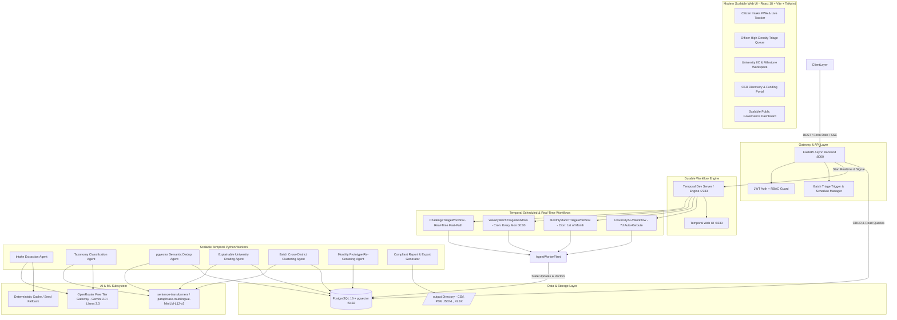

# Nitivayu — Crowdsourced Societal Challenge Pipeline

**Problem Statement ID:** SIH26043 | **Theme:** Governance & Administration | **Team:** QuantumQuest

Nitivayu is a durable, multi-agent AI pipeline that converts messy, multilingual citizen grievances into structured, academically matched, funded, and milestone-tracked research challenges with enforceable Service Level Agreements (SLAs).

📖 **[Complete User Manual & Operations Guide (USER.md)](USER.md)** — Step-by-step operating instructions for Citizens, Nodal Officers, Universities, CSR Partners, and Admins.

## Architecture



## Prerequisites
- **Docker** & **Docker Compose**
- **OpenRouter API Key** (for accessing free-tier LLMs)

## Quick Start (Windows)

For single-click management on Windows:

1. **One-Time Setup** (Run once on a new system):
   ```cmd
   installation.bat
   ```
   *Checks Docker prerequisites, configures `.env`, verifies output directories, and pre-builds all Docker images.*

2. **Start Platform**:
   ```cmd
   start.bat
   ```
   *Launches all services in the background and displays live links.*

3. **Stop Platform**:
   ```cmd
   stop.bat
   ```
   *Gracefully shuts down all containers while preserving database and workflow state.*

---

## Manual Setup Instructions

1. Clone the repository.
2. Copy `.env.example` to `.env` and set your own values (especially `JWT_SECRET` and `OPENROUTER_API_KEY`):
   ```bash
   cp .env.example .env
   ```
3. Run the multi-service composition:
   ```bash
   docker compose up --build
   ```
4. (Recommended) Load the deterministic demo dataset so every portal is populated:
   ```bash
   docker compose --profile demo run --rm seed
   ```
   The seeder is idempotent — re-running it never creates duplicates.

## Service URLs
- **Frontend (Web UI)**: [http://localhost:3000](http://localhost:3000)
- **Backend API**: [http://localhost:8000](http://localhost:8000) (Swagger UI at `/docs`, health at `/api/health`)
- **Temporal Web UI**: [http://localhost:8233](http://localhost:8233)

## Demo Accounts & Data

Sign in at `/login` with any password:

| Portal | Email |
| --- | --- |
| Officer / Admin | `officer@nitivayu.gov.in` / `admin@nitivayu.in` |
| University | `iic.head@bitmesra.ac.in` |
| CSR Industry | `csr@tatasteel.com` |

Tracking tokens `NITIVAYU-2026-JH-DEMO01` … `NITIVAYU-2026-JH-DEMO15` can be entered at `/track`.

The seed dataset includes:
- **6 Universities**: BIT Mesra, NIT Jamshedpur, IIT (ISM) Dhanbad, CUJ, Ranchi University, XLRI
- **4 CSR Industries**: Tata Steel, CCL, BCCL, Vedanta
- **15 Ground Truth Civic Challenges**: realistic Jharkhand submissions spread across every pipeline stage — pending officer review, offered to universities, accepted with project teams & milestones, and CSR-funded.
- **Officers, route assignments, project teams, milestones, funding pledges, and audit logs** exercising every portal workflow.

## Running Tests

```bash
pip install -r backend/requirements.api.txt pytest httpx
pytest            # configured by pytest.ini
```

## Tech Stack

| Layer | Technology |
| --- | --- |
| **Frontend** | React 18, Vite 5, Tailwind CSS, Lucide Icons, TanStack Virtual |
| **Backend API** | FastAPI (Python 3.12, AsyncIO, Pydantic v2) |
| **Workflow Engine** | Temporal.io (Dev Server container / Python SDK) |
| **Database & Vectors** | PostgreSQL 16 + `pgvector` extension |
| **LLM Inference** | OpenRouter Free-Tier (`google/gemini-2.0-flash-exp:free`) |
| **Local Embeddings** | `sentence-transformers/paraphrase-multilingual-MiniLM-L12-v2` |
| **Containerization** | Docker Compose v2 |

## API Endpoints Summary
- `POST /api/v1/submissions` - Submit a new civic challenge
- `GET /api/v1/submissions/{id}` - Get submission status
- `GET /api/v1/challenges/queue` - Get triage queue for officers
- `POST /api/v1/challenges/{id}/approve` - Officer approval
- `GET /api/v1/reports/weekly` - Generate and fetch weekly report

---
*Built with ❤️ by Team QuantumQuest*
