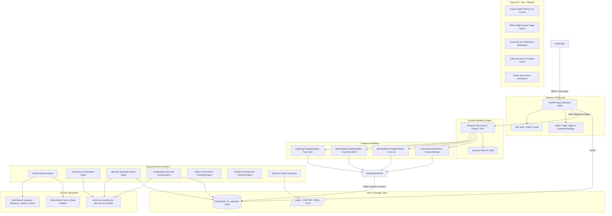

# Nitivayu — Crowdsourced Societal Challenge & Civic Innovation Pipeline

**Problem Statement ID:** SIH26043 | **Theme:** Governance & Administration | **Team:** QuantumQuest
**Region Focus:** Jharkhand, India

> **One-line pitch:** Nitivayu converts messy, multilingual citizen grievances into structured, academically-matched, CSR-funded, milestone-tracked research challenges with enforceable SLAs — *"Helplines close tickets. We solve problems."*

📖 **Companion docs:**
- `USER.md` — Complete User Manual & Operations Guide (Citizen, Officer, University, CSR, Admin workflows)
- `project_implementation.md` — Technical Implementation Blueprint & Architecture Specification
- `plan4.md` — Plan-4 status: live-pipeline closure (what is done, what remains, definition of done)

---

## Table of Contents

1. [Context & Problem](#1-context--problem)
2. [Solution Overview](#2-solution-overview)
3. [USP — Why Nitivayu Is Different](#3-usp--why-nitivayu-is-different)
4. [Features In Detail](#4-features-in-detail)
5. [How It Works — End-to-End Lifecycle](#5-how-it-works--end-to-end-lifecycle)
6. [AI Triage Engine](#6-ai-triage-engine)
7. [Durable Workflows (Temporal)](#7-durable-workflows-temporal)
8. [Architecture](#8-architecture)
9. [Tech Stack](#9-tech-stack)
10. [Data Model](#10-data-model)
11. [Backend API Reference](#11-backend-api-reference)
12. [Frontend — Pages & UX](#12-frontend--pages--ux)
13. [Output Files & Compliance](#13-output-files--compliance)
14. [Seed Data & Demo Accounts](#14-seed-data--demo-accounts)
15. [Project Structure](#15-project-structure)
16. [Setup & Run](#16-setup--run)
17. [Configuration](#17-configuration)
18. [Testing](#18-testing)
19. [Troubleshooting & FAQ](#19-troubleshooting--faq)
20. [Limitations & Roadmap](#20-limitations--roadmap)

---

## 1. Context & Problem

### 1.1 Governance gap
Traditional grievance systems (CPGRAMS, state CM helplines) are **transactional ticket registers**: they optimize for fast closure, not systemic resolution. A fluoride-contaminated handpump gets a one-line reply, not a research-backed filter.

Simultaneously:
- Jharkhand has **30+ higher-education institutions** (BIT Mesra, NIT Jamshedpur, IIT-ISM Dhanbad, CUJ, Ranchi University, XLRI, etc.) that need authentic real-world problems under **NEP 2020 experiential learning** and IIC mandates.
- Over **₹1,475 Cr in CSR funds** from mining/steel/energy PSUs and corporates remains disconnected from grassroots innovation.
- Citizen reports are **multilingual (Hindi / Hinglish / English), noisy, PII-laden, geo-imprecise, and duplicated** across villages/districts.

### 1.2 Design philosophy
**Control in Code, Judgement in AI, Accountability in Humans:**

| Principle | Implementation |
|---|---|
| **Deterministic control** | Temporal.io durable workflows own state, retries, cron, SLA timers, human signals. No lost state on crash/restart. |
| **Stochastic judgement** | OpenRouter LLMs + local multilingual embeddings confined to atomic activities with strict JSON schema + deterministic fallback cache. |
| **Human accountability** | Nodal officers approve / override / reject. Universities accept within 7-day SLA. Every decision is audit-logged. |

---

## 2. Solution Overview

Nitivayu is a **10-service Docker Compose platform** (postgres, temporal, backend, worker, frontend, redis, minio, pgbouncer, prometheus, grafana):

```
Citizen Intake (Hindi/Hinglish/English + Geo + up to 4 photos + audio note + reporter opt-in)
  → FastAPI async backend (fail-closed auth, rate limits, SSE fan-out via Redis)
  → Temporal durable triage (Extract → Classify/Embed → Dedup → Route)
  → Media pipeline async (Scan → Normalize → Transcribe, MinIO/S3 or local mirror)
  → Officer verification gate (72h SLA, escalations feed)
  → University assignment (7-day SLA workflow, auto-reroute, team + M1/M2/M3 auto-create)
  → Team updates + Milestone submit/verify (M3 verifies → COMPLETED)
  → CSR funding discovery + pledge + impact + monthly matrix
  → Citizen live tracking (SSE-first) + compliance exports (CSV/PDF/JSONL/XLSX)
  → Weekly batch + Monthly macro (centroids, seasonal weights, CSR matching)
```

It operates on a **dual-cadence**:

1. **Real-time fast-path (<10s):** single submission → instant structuring + candidate university list + officer queue entry.
2. **Scheduled batch (Weekly Monday 00:00 + Monthly 1st):** global dedup, cross-district macro-clustering, capacity re-balancing, official CSV/PDF reports, theme-centroid refresh + CSR matching.

---

## 3. USP — Why Nitivayu Is Different

1. **Grievance → Research Challenge, not ticket:** PII-stripped LLM extraction produces `title, summary, category (10-taxonomy), severity 1-5, location_hint` — a research-ready problem, not a closed ticket.
2. **Durable execution with Temporal:** 72h officer wait + 7-day university SLA (5d + 48h warning + 2d grace) survive restarts. 5 workflows + 21 activities on `triage-queue`, visually inspectable at `:8233` — strong demo asset.
3. **Explainable routing, not black-box:** 4-factor score `theme/semantic/capacity/geo` with per-match `score_breakdown` shown to officers. Weights are the single source of truth in `Settings` (`SCORE_WEIGHT_*`, defaults `0.4/0.3/0.2/0.1`), served to the UI via `GET /meta/config` and consumed through `lib/meta` — no hardcoded divergence (see §6.4).
4. **Multilingual CPU-first AI:** `paraphrase-multilingual-MiniLM-L12-v2` (384-d, ~45ms on CPU, 120MB) handles Hindi/Hinglish/English with zero API cost; pgvector does `<15ms` ANN cosine search. OpenRouter (`nvidia/nemotron-3-ultra-550b-a55b` default) is wrapped with retries + Redis-backed LLM cache (`llm:cache:<sha256>`, 7d TTL) + `LLM_CACHE=1` offline fallback so demos work without a key.
5. **Single DB for relations + vectors:** PostgreSQL 16 + `pgvector` (`ivfflat`, `vector_cosine_ops`) avoids a separate vector DB and sync lag.
6. **Human-in-the-loop SLAs with auto-escalation:** Officer 72h → `ESCALATED` + `/officer/escalations` feed (SLA-breach-risk, severity-5, escalated); University 7d (`UniversitySLAWorkflow` started on APPROVE/OVERRIDE, accept/decline signals) → auto-reroute + `current_load` accounting.
7. **CSR bridge:** Industries discover `ROUTED/ACCEPTED` problems and pledge INR; `/industry/impact` + monthly XLSX funding matrix maps corporate focus areas to projects.
8. **Compliance by default:** `/output/{triage,sla,reports,audit,csr,media}` generates `Nitivayu_*` BOM CSV, append-only SLA CSV, weekly PDF, immutable JSONL, monthly XLSX (plus S3 copy when enabled).
9. **Scale-ready UI:** workspace code-splitting (`React.lazy` per workspace), `RequireWorkspace` guards, `lib/meta` shared pipeline constants, keyboard shortcuts (`j/k/a/r/x`); optimistic updates; live telemetry dashboard + Prometheus/Grafana.
10. **Continuous learning flywheel (live):** Monthly workflow audits officer overrides, recomputes theme centroids, applies seasonal weights, runs CSR matching, exports XLSX — verified by live manual run (see `plan4.md` §1.1 B2).

---

## 4. Features In Detail

### 4.1 Citizen — Intake & Live Tracking (`/`, `/track/:token`, `/app/citizen/*`)
- **Natural-language form (`EvidenceComposer`):** Hindi / Hinglish / English textarea, District + Block dropdowns (served by `/meta/config`, offline fallback bundled), GPS auto-detect with manual fallback, up to 4 photos + 1 audio note (5MB limit each, `MAX_UPLOAD_BYTES`), language preference.
- **Reporter identity (opt-in):** optional name + email/phone + notify-consent checkbox. Contacts are normalized (`notify_reporter.normalize_*`); stored only when consent + contact are both present. Signed-in citizens link via `submissions.user_id` → “My reports” works across devices (`GET /citizen/reports`, `POST /citizen/reports/claim`, `GET/PATCH /auth/me`).
- **Validation:** blank → 422, >5000 chars → 422, oversize photo/audio → 413. Rate-limited (`RATE_LIMIT_SUBMIT_PER_MIN`).
- **Instant response:** `202 Accepted` with `submission_id` + human tracking token `NITIVAYU-YYYY-JH-XXXXXX`.
- **Resilience:** API creates `Submission (PENDING_TRIAGE)` + heuristic `Problem (PENDING_OFFICER_REVIEW)` + fallback `RouteAssignment` immediately, then *best-effort* starts `ChallengeTriageWorkflow` + `MediaProcessingWorkflow` (scan → normalize → transcribe; `ASR_ENABLED=false` returns `{transcript: None}` by design). If Temporal is down, submission still succeeds via deterministic fallback.
- **Live tracker (SSE-first):** timeline `Ingested → AI Triaging → Officer Review → Routed → Milestone R&D → Resolved`; shows title, category, severity, district, matched university, M1-M3 milestone list, university progress updates, last-10 audit activity. Public `GET /submissions/{token}/track` (no auth); live fan-out on `track:{token}` + `public` channels with polling fallback.
- **PII hygiene:** 10-digit phones and Aadhaar `XXXX XXXX XXXX` redacted to `[REDACTED ...]` before LLM call.

### 4.2 Nodal Officer — Triage Queue & Verification (`/app/officer`)
- **Auth (fail-closed):** JWT + RBAC (`require_role("officer","admin")`). Officer passwords are bcrypt-verified; unknown emails → 401 (no substring role guessing). Seeded university/industry contact emails are demo-only logins; `/meta/demo-accounts` lists them only when `DEMO_MODE=true`.
- **Queue:** `GET /officer/review-queue?skip&limit (max 100)` → `{items, total, skip, limit, has_more}` with `PENDING_OFFICER_REVIEW` problems, submission join (incl. `reporter_name`), top-3 matches, `sla_hours_remaining` (from first assignment deadline, default 48h).
- **Escalations:** `GET /officer/escalations` → SLA-breach-risk (80% of `OFFICER_SLA_HOURS` elapsed), severity-5 pending, and `ESCALATED` items with `reason` + `age_hours`. `assigned_officer_id` is written on decision.
- **Detail:** `GET /officer/problems/{id}` + `GET /officer/problems/{id}/updates` power `/app/officer/review/:id` (score breakdown, evidence, timeline, casefile).
- **Card data:** category (10-taxonomy), severity badge 1-5, district, reporter, top match + score, SLA countdown, score breakdown.
- **Actions:** `APPROVE` → `ROUTED` + assignment `OFFERED` + `UniversitySLAWorkflow` start; `OVERRIDE` (requires `override_university_id`) → re-points assignment + `match_score=1.0` + `officer_override` breakdown; `REJECT` → `REJECTED` + all assignments `CANCELLED`. Re-review → 409. Bad UUID → 422.
- **Milestones:** `POST /officer/milestones/{id}/verify {VERIFY|REJECT}` — only `SUBMITTED` → `VERIFIED`/`REJECTED`; verifying M3 completes the problem (`COMPLETED`, frees `current_load`) and notifies the citizen tracker + university channel.
- **Media moderation:** `POST /officer/media/{asset_id}/clear` clears `flagged` evidence → `clean` (else 409).
- **Workflow signal:** DB decision is authoritative; backend also signals running Temporal workflow (`officer_approval_signal`: `approve/reject`, OVERRIDE maps to `approve`). Signal failure only warns, never rolls back DB. Dedicated `POST /officer/reviews/{id}/signal` for explicit signaling (404 if no workflow, 502 if Temporal unreachable).
- **UX:** high-density table with search/filter by district/keyword/category/status, bulk approve, `j/k` navigate, `a` approve, `r` reject, `x` multi-select, optimistic UI with rollback; toasts on `role:`/`org:` SSE channels.

### 4.3 Batch Admin — Cadence Control (`/app/officer/batch`)
- **Real control plane (`routes/batch_triage.py`):** `GET /admin/triage/schedules` → `{active_cadence, cron_expression, next_run_utc, monthly_macro_cron, monthly_next_run_utc, pending_count, schedule_status}` backed by the `cadence_configs` row + live Temporal schedules (`nitivayu-batch-weekly`, `nitivayu-batch-monthly`).
- **Trigger:** `POST /admin/triage/trigger-batch {cadence_type: weekly, include_unassigned_only}` → `{batch_workflow_id, status, stream_url}`. Creates a `batch_runs` row (`RUNNING`) and starts the real `WeeklyBatchTriageWorkflow` on `triage-queue`; progress streams live over SSE (`?token=`).
- **History:** `GET /admin/triage/batch-jobs` → `batch_runs` with totals, processed/failed/duplicates, CSV/PDF paths, durations. `PUT /admin/triage/schedules` validates 5-field crons and upserts both Temporal schedules (idempotent).
- **Batch steps (all wired):** fetch pending window (`BATCH_MAX_SUBMISSIONS`, oldest first, stamps `submissions.batch_id`) → batch extract+embed (per-item SAVEPOINTs, never fails whole batch) → cross-district cluster/dedup (union-find on cosine ≥ threshold, `cluster_group_id`, `MERGED`) → global capacity-balanced routing (severity order + in-memory load ledger) → `Nitivayu_*` triage CSV + routing PDF → officer digest notify.
- **UI:** cadence manager, last/next run from Temporal, unprocessed count, `Run Batch Triage Now` with SSE progress (Ingest → Embed → Cluster → Balance → Export).

### 4.4 University IIC — Inbox, Teams, Milestones (`/app/university`)
- **Workspace scoping (exact, no guessing):** JWT `organization_id` must equal the university; login matches `universities.nodal_contact_email` exactly (or a provisioned `users` row). No `.ac.in`/substring heuristics. Unlinked → 403.
- **Inbox:** `GET /university/inbox` → `OFFERED` assignments for own university, newest first: assignment_id, problem title/summary/category/severity/district/reporter/match_score/SLA.
- **Detail:** `GET /university/assignments/{id}` powers `/app/university/inbox/:id` (evidence, score breakdown, casefile, updates).
- **Respond:** `POST /university/assignments/{id}/respond {ACCEPT|DECLINE}`. Cross-university → 403, double-answer → 409. ACCEPT → assignment `ACCEPTED` + `responded_at` + problem `ACCEPTED` + auto-created `ProjectTeam (TEAM_FORMED)` + M1/M2/M3 + `current_load+1` + audit; sends `university_acceptance_signal`. DECLINE releases the SLA workflow to the next university.
- **SLA:** 7 days total (`UNIVERSITY_SLA_HOURS=168`: 5d silent + warning at 48h remaining + 2d grace → auto-decline/reroute via `UniversitySLAWorkflow`; escalation activity if all decline). SLA constants come from `/meta/config` (`lib/meta`).
- **Projects:** `GET /university/projects` → teams for own university with milestones sorted, `current_milestone` = first non-VERIFIED.
- **Team formation (UI + API):** `PATCH /university/teams/{id}` fills mentor/lead/proposal on the auto-created TBD team; milestones auto-created on ACCEPT:
  - M1 Feasibility Study (M1_DAYS=14)
  - M2 Prototype Design (M2_DAYS=45)
  - M3 Field Validation (M3_DAYS=90)
- **Milestone evidence:** `POST /university/milestones/{id}/submit` (doc/GitHub/lab-report URL + notes, multipart) → `SUBMITTED` → officer verify → `VERIFIED`/`REJECTED` (M3 verify → `COMPLETED`).
- **Progress updates:** `GET/POST /university/teams/{team_id}/updates` (text + milestone tag + photos) — surfaced on the citizen tracker in plain language.

### 4.5 CSR Partner — Discovery & Pledging (`/app/corporate`)
- **Workspace scoping (exact):** JWT `organization_id` = industry; login matches `industries.contact_email` exactly (or provisioned user). No `csr/tata` substring fallback. Unlinked → 403.
- **Opportunities:** `GET /industry/opportunities` → up to 50 `ROUTED/ACCEPTED` problems with assigned university, pledged sum (aggregated), confidence. Filter by sector/district in UI.
- **Pledge:** `POST /industry/pledges {problem_id, team_id?, pledged_amount_inr>0}` → `FundingLink(PLEDGED)`. Only `ROUTED/ACCEPTED` problems (else 409); team must belong to problem (else 422). Unlinked industry → 403.
- **Portfolio:** `GET /industry/pledges` → own pledges with problem titles + `total_pledged_inr` + `projects_funded`.
- **Impact + exports:** `GET /industry/impact` powers the impact page (no fabricated goal bars); `POST /industry/exports/monthly-matrix` + `MonthlyMacroTriageWorkflow` match validated challenges to CSR focus areas → `/output/csr/*.xlsx`.

### 4.6 System Admin & Telemetry (`/app/admin`)
- **Workspaces:** orgs (`AdminOrgsPage`), telemetry (`AdminTelemetryPage`), exports (`AdminExportsPage`) — all on live endpoints.
- **Public analytics:** `GET /analytics/overview` (Redis-cached, `ANALYTICS_CACHE_TTL_SECONDS`) → total submissions/problems, throughput, SLA compliance %, active universities, total pledged INR, category/district/severity distributions. Powers Recharts visualizations + landing/impact pages via `/meta/public-stats`, `/meta/partners`, `/meta/featured-cases`.
- **Service health:** `GET /admin/health/services` powers dashboard badges (DB, Temporal, Redis, S3/MinIO). Prometheus scrapes `backend:8000/metrics`; Grafana at `:3001` (see `monitoring/`).
- **Exports + invites:** `routes/admin_exports.py` — invites list/revoke, 4 compliance exports + auth-gated download. `POST /admin/reports/triage` (officer/admin) dumps all problems to `/output/triage/*.csv` via `write_triage_csv`.
- **Meta (single source of truth):** `GET /meta/config` → SLA hours, `score_weights`, categories, languages, districts, `max_upload_mb`, milestone structure (consumed by `lib/meta`). `GET /meta/demo-accounts` → 404 unless `DEMO_MODE=true`.

### 4.7 Auth & Security
- **Fail-closed identity:** JWT (`HS256`, `JWT_SECRET`, 24h expiry); `get_current_user` → `{user_id, role, organization_id, workspace_type}`; `require_role(*roles)` with clear 403s. Officer passwords bcrypt-enforced; registered/invited `users` rows bcrypt-enforced; exact university/industry contact-email demo matches only (logged); unknown emails → 401. No email-substring role guessing.
- **OTP + invites:** `POST /auth/request-otp` / `verify-otp` (`SMS_PROVIDER=log|twilio|msg91`, `ALLOW_DEV_OTP` demo echo, `OTP_TTL_SECONDS`, `OTP_MAX_ATTEMPTS`, `OTP_RESEND_SECONDS`); admin invites (`INVITE_TTL_DAYS`, list/revoke).
- **Google OAuth (hardened):** signed state + TTL, `id_token` aud/iss/exp verify, one-time `?code=` exchange; env-gated (answers 501 until `GOOGLE_CLIENT_ID/SECRET` set). Facebook retired.
- **Hardening:** rate limits (`RATE_LIMIT_AUTH_PER_MIN`, `RATE_LIMIT_SUBMIT_PER_MIN`, Redis-backed), CORS allowlist from `CORS_ORIGINS`, lazy DB engine (no import-time crashes), `GET/PATCH /auth/me` for citizen profiles.
- **PII:** reporter contacts are per-report opt-in (`contact_email/contact_phone/notify_consent`); intake redacts phones/Aadhaar before LLM. Immutable `audit_logs` (entity_type/id, action, actor, before/after JSONB, IP, request_id) + file append in `/output/audit`.

### 4.8 Notifications, Media & Realtime
- **Reporter notifications (live):** `services/notify_reporter.py` — Gmail SMTP + Twilio/MSG91 SMS, verified by real delivery; log-only when hosts/keys are empty. Opt-in contacts get backgrounded updates on submitted / approved / rejected / overridden / accepted / declined / milestones. `services/notify.py` covers identity OTP + admin invites.
- **Media pipeline:** `MediaProcessingWorkflow` (scan → normalize → transcribe) runs async on upload; `MediaAsset` rows (`pending/flagged/clean`); MinIO/S3 (`S3_ENABLED`) or local `MEDIA_DIR` mirror; first photo doubles as legacy `photo_url`. `ASR_ENABLED=false` and `MODERATION_ENABLED=false` are honest stubs by design (see `plan4.md` B10).
- **Realtime events:** `routes/events.py` SSE (`GET /events/stream?token=`) on channels `track:{token}`, `public`, `org:{id}`, `role:{role}`; Redis fan-out; tracker is SSE-first with polling fallback.
- **Reports:** `activities/report_gen.py` + `services/outputs.py` generate IO-spec files (see §13). Feed (`/feed/*`) + casefile (`/casefile/*`) expose public activity and evidence.

---

## 5. How It Works — End-to-End Lifecycle

```
1. Citizen submits (Hindi/Hinglish/English + district/block + up to 4 photos + audio + opt-in contact)
2. POST /api/v1/submissions → Submission + heuristic Problem + fallback Assignment + audit + best-effort Temporal starts (triage + media) + SSE fan-out + reporter confirmation
3. ChallengeTriageWorkflow(submission_id, raw_text, district):
     extract_submission_activity → classify_and_embed_activity → check_deduplication_activity
       → if duplicate: MERGED, return DUPLICATE
       → else route_to_universities_activity (top-3 offers, status OFFICER_REVIEW)
     → wait officer_approval_signal up to OFFICER_SLA_HOURS (72h, escalate on timeout)
   MediaProcessingWorkflow([{asset_id, kind, storage_url}]) runs in parallel (scan → normalize → transcribe)
4. Officer reviews queue/escalations → APPROVE / OVERRIDE / REJECT (DB + signal + SLA workflow start + reporter notify)
5. ROUTED problem appears in university inbox; UniversitySLAWorkflow 7-day timer starts (warning → grace → auto-decline/reroute)
6. University ACCEPTs → team + M1-M3 auto-created (+load) + accept signal; DECLINE/timeout → next-ranked university
7. Team posts updates; submits M1→M2→M3 evidence; officer verifies (M3 → COMPLETED, −load)
8. CSR discovers ROUTED/ACCEPTED → pledges FundingLink; impact + monthly matrix
9. Weekly batch aggregates window; Monthly macro refreshes centroids + seasonal weights + CSR matrix
10. Citizen tracks live (SSE); audit + CSV/PDF/JSONL/XLSX emitted throughout
```

**Concrete walkthrough:** `Garhwa handpump fluoride` → extracted as `Water, severity 5` → 384-d MiniLM embedding → pgvector dedup (threshold configurable) → scored: BIT Mesra 0.912 (Water Purification + Ranchi proximity + capacity) → officer approves → BIT inbox → Dr. P. Sharma team accepts → Tata Steel pledges ₹15L → M1 Feasibility (VERIFIED) → M2 Prototype (SUBMITTED) → M3 Pilot (PENDING) → citizen sees `ACCEPTED + milestones`.

---

## 6. AI Triage Engine

### 6.1 Intake Extraction Agent (`activities/extract.py` + `services/llm.py`)
- **If `OPENROUTER_API_KEY` set:** POST to `{BASE}/chat/completions` with `model` (default `nvidia/nemotron-3-ultra-550b-a55b`), `temperature: 0`, prompt demanding JSON-only `{title≤120, summary≤500, category∈10, severity 1-5, location_hint≤120}`. Strips ```json fences, `json.loads`, validates via `_validate_extraction`.
- **If no key:** checks file cache `app/cache/llm_cache.json` by `sha256(model|normalized_text)` → `local_cache`; else deterministic heuristic (`local_fallback`): first sentence as title, keyword category, severity 4 if urgent/danger/flood/broken/severe/critical else 3.
- **Quota handling:** 402 → warn + local fallback (marked); 401/403 → ValueError (auth); timeout/transport → RuntimeError (retryable); blank → ValueError (non-retryable).
- **Normalization:** `canonicalize_category` (exact → alias map `water pollution→Water` etc. → keyword scan → `Governance`); `coerce_severity` (int 1-5 or word map `critical:5…minor:2`, bool rejected).
- **Side effects:** sets submission `TRIAGING`, updates problem title/summary/category/severity (if pre-decision), writes `TRIAGE_EXTRACTED` audit. Returns `{title,summary,category,severity,location_hint,source}`.

### 6.2 Taxonomy Classification + Embeddings (`activities/classify.py` + `services/embeddings.py`)
- Model `sentence-transformers/paraphrase-multilingual-MiniLM-L12-v2`, 384-d, lazy singleton per worker process, `normalize_embeddings=True`, honors `SENTENCE_TRANSFORMERS_HOME` (`model_cache` volume). Dimension mismatch → RuntimeError. Blank → non-retryable.
- Stores `summary_embedding` + `confidence 0.85`; extraction owns category — only fills when stored is empty/`Governance`. Audit `TRIAGE_CLASSIFIED`.

### 6.3 Semantic Dedup (`activities/dedup.py`, pgvector)
- Validates 384 finite floats. Threshold from `DEDUP_SIMILARITY_THRESHOLD` ((0,1]); converts to `max_distance = 1-threshold`.
- Query: `ORDER BY summary_embedding <=> :embedding LIMIT 1` (cosine distance), excludes self, requires non-null embedding. If `distance ≤ max_distance` → `is_duplicate=True`, `duplicate_of_id`, statuses → `MERGED`. Audit `TRIAGE_DEDUP_CHECKED`.
- Real-time scope is global nearest-neighbor (spec also describes district-scoped `>0.85` fast check + cross-district batch clustering via `cluster.py`).

### 6.4 Explainable University Routing (`activities/route.py`)
Implemented scoring (deterministic, capacity-aware, single source of truth):

```python
weights = score_weights()  # Settings SCORE_WEIGHT_* (defaults 0.4/0.3/0.2/0.1), served at /meta/config
available = active_capacity - current_load   # skip if <=0
theme = 1.0 if category in profile else 0.7 if word-overlap else 0.3
semantic = (cosine+1)/2  (0.5 if no embedding)
capacity = available / active_capacity
geo = 1.0 if same district else 0.5
match_score = w_theme*theme + w_semantic*semantic_score + w_capacity*capacity + w_geo*geo
```

Top-3 retained with `score_breakdown{semantic,theme,capacity,geo}`, sorted by `(-score, name)`. Pre-decision only: replaces auto offers, advances to `OFFICER_REVIEW`, audit `TRIAGE_ROUTED`. Batch variant `global_university_routing_activity` routes in severity order with an in-memory load ledger so one batch does not overload the top university.

### 6.5 Batch Clustering & Flywheel (all wired)
- `activities/cluster.py`: cross-district agglomerative clustering (union-find on cosine ≥ `DEDUP_SIMILARITY_THRESHOLD`): members share `cluster_group_id`; newest duplicates `MERGED` into oldest (pre-decision only) — e.g., 14 fluoride village reports → 1 Macro-Challenge. Writes `BATCH_CLUSTERED` audits + `batch_runs.duplicates`.
- Monthly (`activities/macro.py` + `workflows/monthly_macro.py`, typed refs): audit overrides → recompute theme centroids (`theme_centroids`) → seasonal weight adjust (`seasonal_weights`) → CSR matching → XLSX export. Verified by live manual run (see `plan4.md` B2); monthly Temporal schedule `nitivayu-batch-monthly` created from `monthly_macro_cron`.
- Batch extract (`activities/extract.py`): `fetch_pending_batch_submissions_activity` (oldest-first, capped by `BATCH_MAX_SUBMISSIONS`, stamps `batch_id`) + `batch_extract_and_embed_activity` (per-item SAVEPOINTs, mirrors real-time rules).

---

## 7. Durable Workflows (Temporal)

Task queue: `triage-queue`. Worker (`app/worker.py`) registers **5 workflows + 21 activities** with connect retry (12×5s).

| Workflow | File | Trigger | Logic |
|---|---|---|---|
| **ChallengeTriageWorkflow** | `workflows/triage_workflow.py` | Citizen submit | Extract (3 attempts) → Classify/Embed (5) → Dedup (5) → Route → wait `officer_approval_signal` `OFFICER_SLA_HOURS` → `ROUTED_TO_UNIVERSITY` / `REJECTED` / `ESCALATED_TO_SENIOR_OFFICER`; duplicate short-circuits `DUPLICATE`. |
| **MediaProcessingWorkflow** | `workflows/media_workflow.py` | Citizen submit with photos/audio | Scan → Normalize → Transcribe (`ASR_ENABLED=false` → `{transcript: None}` by design); never blocks triage. |
| **WeeklyBatchTriageWorkflow** | `workflows/weekly_batch.py` | Temporal schedule `nitivayu-batch-weekly` / admin button | fetch pending → batch extract+embed → cluster+dedup → global routing → triage CSV → routing PDF → officer digest → `{batch_id, processed, csv, pdf, COMPLETED}` + `batch_runs` row. |
| **MonthlyMacroTriageWorkflow** | `workflows/monthly_macro.py` | Temporal schedule `nitivayu-batch-monthly` / admin button | audit overrides → recompute centroids → seasonal weights → CSR match → XLSX export → `{status: SUCCESS, …}`. |
| **UniversitySLAWorkflow** | `workflows/sla_workflow.py` | On ROUTED (APPROVE/OVERRIDE) | For each ranked uni: wait `university_acceptance_signal` 5d → `send_sla_warning` → wait 2d → decline → next; all decline → `escalate_to_state_admin` → `ESCALATED`, else `ACCEPTED`. Started best-effort (`sla-{assignment_id}`); DB is authoritative. |

State helpers (`services/triage_state.py`): `PRE_DECISION_STATUSES`, `advance_status`, `audit_once` (idempotent), `load_submission_problem`, `replace_auto_route_offers`.

---

## 8. Architecture

### 8.1 Diagram


### 8.2 Container topology (`docker-compose.yml`, 10 services)
| Service | Image / Build | Ports | Volumes / Health |
|---|---|---|---|
| `postgres` | `pgvector/pgvector:pg16` | `5433:5432` (host 5433 to avoid local clash) | `postgres_data`, `./backend/scripts/init_db.sql` → initdb; `pg_isready` |
| `temporal` | `temporalio/temporal:latest`, `server start-dev --ip 0.0.0.0 --port 7233 --ui-port 8233 --db-filename /data/temporal.db`, `user 0:0` | `7233:7233` gRPC, `8233:8233` UI | `temporal_data:/data`; `temporal operator cluster health` |
| `backend` | `./backend/Dockerfile` (FastAPI+uvicorn) | `8000:8000` | `output_data:/app/output`, `./backend:/app:ro`; `curl /api/health` |
| `worker` | `./backend/Dockerfile.worker` | — | `output_data`, `model_cache:/root/.cache/torch/sentence_transformers` |
| `frontend` | `./frontend/Dockerfile` (Node build → Nginx) | `3000:80` | `curl http://127.0.0.1/` (IPv4 explicit for busybox) |
| `redis` | `redis:7-alpine` (`--appendonly yes`) | `${REDIS_PORT:-6379}:6379` | `redis_data:/data`; `redis-cli ping` |
| `minio` | `minio/minio:latest` (`server /data --console-address :9001`) | `9000:9000`, `9001:9001` | `minio_data:/data`; `/minio/health/live` |
| `pgbouncer` | `edoburu/pgbouncer` (transaction, 200/25) | `6432:6432` | `pg_isready -h 127.0.0.1 -p 6432` (opt-in via `PGBOUNCER_URL`) |
| `prometheus` | `prom/prometheus` | `9090:9090` | `./monitoring/prometheus.yml:/etc/prometheus/prometheus.yml:ro` (scrapes `backend:8000/metrics`) |
| `grafana` | `grafana/grafana` | `3001:3000` | `./monitoring/grafana-datasources.yml` + `grafana_data`; `GF_SECURITY_ADMIN_*` |

Shared env: `DATABASE_URL` (asyncpg via `postgres:5432` internal), `TEMPORAL_HOST=temporal:7233`, `TEMPORAL_NAMESPACE=default`, `OPENROUTER_*`, `LLM_CACHE=1`, `JWT_SECRET`, `REDIS_URL`, `S3_*/MINIO_*`, `SMTP_*/TWILIO_*/MSG91_*`, `GOOGLE_*`, `RATE_LIMIT_*`, `DEMO_MODE`.

### 8.3 Key request flows
- **Submit:** `multipart/form-data (text + up to 4 photos + audio + opt-in contact) → 202 + token → Temporal triage + media starts (warn-only on fail) → SSE fan-out → reporter confirmation (backgrounded)`.
- **Review:** `JWT(officer) → queue/escalations → decision → DB commit + audit file → Temporal signal (warn-only) → SLA workflow start → SSE + reporter notify`.
- **University/CSR:** `JWT(university/industry) → org-scoped inbox/opportunities → respond/pledge → audit → SSE + reporter notify`.
- **Realtime:** `GET /events/stream?token=` (EventSource, no headers) on `track:/public:/org:/role:` channels; Redis fan-out; polling fallback.
- **Health:** `GET /api/health` (`SELECT 1` → `200 healthy / 503 degraded`); `GET /admin/health/services` (DB/Temporal/Redis/S3 badges); `GET /metrics` (Prometheus).

---

## 9. Tech Stack

| Layer | Technology | Why |
|---|---|---|
| **Frontend** | React 18, Vite 5, Tailwind 3, Lucide, Recharts, react-router 7, axios | Workspace code-splitting, `RequireWorkspace` guards, `lib/meta` shared constants, charts, icons |
| **Backend API** | FastAPI, Python 3.12, AsyncIO, Pydantic v2 / pydantic-settings, asyncpg, SQLAlchemy 2 async | Non-blocking I/O, strict validation, auto OpenAPI at `/docs`, shared models with workers |
| **Workflows** | Temporal.io dev-server + Python SDK, `triage-queue`, 5 workflows + 21 activities | Durable state, cron schedules, 72h/7d timers, signals, retries; live execution tree for judges |
| **DB & Vectors** | PostgreSQL 16 + `pgvector`, `uuid-ossp/pgcrypto`, `ivfflat vector_cosine_ops`, SQLAlchemy + pgvector `Vector(384)` | One engine for ACID + ANN cosine search; no separate vector DB |
| **LLM** | OpenRouter gateway, default `nvidia/nemotron-3-ultra-550b-a55b` via httpx, temp 0 | Strict JSON; backoff + Redis cache + file fallback |
| **Embeddings** | `sentence-transformers/paraphrase-multilingual-MiniLM-L12-v2`, 384-d, torch cache volume | 120MB, CPU ~45ms, Hindi/Hinglish/English, zero external calls |
| **Auth** | python-jose HS256 JWT 24h, passlib bcrypt (fail-closed), OTP (log/Twilio/MSG91), Google OAuth code flow, invites | Exact org scoping, no role guessing; demo-gated via `DEMO_MODE` |
| **Realtime/Cache** | Redis 7 (cache, OTP/sessions, rate limits, SSE fan-out), SSE `EventSource` | `ANALYTICS_CACHE_TTL_SECONDS`, tracker SSE-first with polling fallback |
| **Storage** | MinIO (S3-compatible) + local `MEDIA_DIR` mirror, `MediaAsset` moderation | Photos/audio/exports; `S3_ENABLED` opt-in |
| **Pooling** | PgBouncer (transaction, opt-in via `PGBOUNCER_URL`) | API replicas never exhaust Postgres |
| **Observability** | Prometheus (`:9090`, scrapes `/metrics`) + Grafana (`:3001`), `/admin/health/services` | Latency/error badges, live telemetry |
| **Exports** | reportlab (PDF), openpyxl (XLSX), csv BOM, JSONL | `Nitivayu_*` IO-spec compliance |
| **Infra** | Docker Compose v2, Nginx (frontend, fresh HTML + immutable assets), uvicorn | One-command repro; `--scale worker=3` horizontal |
| **Tests** | pytest (`pytest.ini`), 109 tests across 11 files + `npm run build` | API, auth, batch, casefile, feed, notify, outputs, plan4, seed, temporal pipeline |

---

## 10. Data Model

PostgreSQL 16 + pgvector. Core tables (`backend/app/db/models.py`, `scripts/init_db.sql` + numbered idempotent migrations mirror them):

- `citizens(citizen_id, phone_encrypted, email_encrypted, language_pref)` — seed-only by design; live citizens are `users` + `submissions.user_id`
- `users(user_id, email_hash, password_hash, workspace_type, organization_id, display_name)` — register/invite/OTP accounts
- `otp_codes` — OTP TTL/attempts/resend enforcement; `org_invites` — admin invites list/revoke
- `submissions(submission_id, user_id→users, citizen_id→SET NULL, raw_text, photo_url, geo_lat/lng/district/block/source, batch_id→batch_runs, tracking_token unique, reporter_name, contact_email/phone, notify_consent, status: PENDING_TRIAGE/TRIAGING/OFFICER_REVIEW/ROUTED/REJECTED/MERGED/COMPLETED)` 1—1 `problems`
- `problems(problem_id, submission_id unique→CASCADE, title, summary, category∈10, severity 1-5, confidence, summary_embedding vector(384), assigned_officer_id, temporal_workflow_id, is_duplicate, duplicate_of_id→self, cluster_group_id, status: PENDING_OFFICER_REVIEW/ROUTED/ACCEPTED/REJECTED/MERGED/ESCALATED/COMPLETED…)` 1—N assignments/teams/updates
- `universities(university_id, name, short_code unique, iic_code, district, geo_lat/lng, domain_specializations TEXT[], active_capacity, current_load, capability_embedding vector(384), nodal_contact_email)`
- `route_assignments(assignment_id, problem_id→CASCADE, university_id→CASCADE, rank_order 1-3, match_score, score_breakdown JSONB{semantic,theme,capacity,geo}, sla_deadline, status: PENDING_APPROVAL/OFFERED/ACCEPTED/DECLINED/CANCELLED/EXPIRED, assigned_at, responded_at)`
- `project_teams(team_id, assignment_id/problem_id/university_id, faculty_mentor_name, student_lead_name, team_members JSONB, proposal_title/doc_url, status)` 1—N `milestones(milestone_id, team_id→CASCADE, milestone_num∈1-3, title M1/M2/M3, due_date, status PENDING/SUBMITTED/VERIFIED/REJECTED, evidence_url, verified_by/at)` + `project_updates(update_id, team_id/problem_id, note, milestone, photo_urls, author)`
- `media_assets(asset_id, submission_id→CASCADE, kind photo/audio, storage_url, size_bytes, moderation_status pending/flagged/clean)`
- `industries(industry_id, name, sector, csr_focus_areas TEXT[], csr_budget_inr, contact_person/email)` 1—N `funding_links(link_id, problem_id→CASCADE, team_id→SET NULL, industry_id→CASCADE, pledged_amount_inr, status PLEDGED/DISBURSED/COMPLETED)`
- `officers(officer_id, name, department, district, role: district_officer/senior_officer/state_admin, email unique, password_hash)`
- `audit_logs(log_id, entity_type/id, action, actor_id/role, before/after JSONB, ip, request_id, timestamp)`
- `cadence_configs(id=default, active_cadence, cron_expression, monthly_macro_cron)` + `batch_runs(batch_id, cadence, status, total/processed/failed/duplicates, csv/pdf_path, started/finished_at, error)` + `theme_centroids` + `seasonal_weights` (macro flywheel)
- `report_likes` (feed likes)

Indexes: `ivfflat` on both vector cols, `status`, `geo_district`, `(entity_type,entity_id)`, `tracking_token`.

---

## 11. Backend API Reference

Base: `http://localhost:8000/api/v1` (Swagger at `/8000/docs`). Routers: `auth, batch_triage, events, admin, admin_exports, meta, citizen, feed, casefile` + legacy `router.py` (submissions/officer/university/industry/analytics).

| Method & Path | Auth | Body / Query | Success |
|---|---|---|---|
| `GET /api/health` | no | — | `200 {status:healthy, service, version, database:ok}` / `503 degraded` |
| `GET /metrics` | no | — | Prometheus metrics (scraped at `:9090`) |
| `POST /api/v1/auth/login` | no | `{email, password}` (fail-closed, rate-limited) | `{access_token, role, workspace_type, organization_id, organization_name, display_name}`; roles: citizen/officer/admin/university/industry |
| `POST /api/v1/auth/register` + `request-otp`/`verify-otp` + OAuth `google` (`/authorize`, `/callback`) + `GET/PATCH /auth/me` | mixed | OTP/invite/OAuth code flow | citizen signup, OTP verify, Google link, profile |
| `POST /api/v1/submissions` | optional (links `user_id` when signed in) | `multipart: raw_text*, language_pref, district, block, geo_*, reporter_name?, contact_email/phone?, notify_consent?, photo×4?, audio_note?` | `202 {submission_id, tracking_token, status}` |
| `GET /api/v1/submissions/{token}/track` | no | — | `{tracking_token, status, title, category, severity, reporter_name, district, submitted_at, matched_university, milestones[], activity[]}` (incl. `PROJECT_UPDATE`s); 404 if unknown |
| `GET /api/v1/citizen/reports` + `POST /citizen/reports/claim {tracking_token}` | citizen | — | My Reports across devices; claim anonymous reports |
| `GET /api/v1/meta/config` | no | — | `{officer_sla_hours, university_sla_hours, score_weights, categories, languages, districts, max_upload_mb, milestone_structure}` |
| `GET /api/v1/meta/demo-accounts` | no | — | 404 unless `DEMO_MODE=true`; else seeded credentials |
| `GET /api/v1/meta/public-stats` + `/partners` + `/featured-cases` | no | — | landing/impact live data (empty-state when none) |
| `GET /api/v1/officer/review-queue?skip&limit` | officer/admin | limit 1-100 | `{items[], total, skip, limit, has_more}` with `top_matches`, `sla_hours_remaining`, `reporter_name` |
| `GET /api/v1/officer/escalations` | officer/admin | — | `{items[], total, sla_hours}` with `reason` (`ESCALATED`/`SEVERITY_CRITICAL`/`SLA_BREACH_RISK`) |
| `GET /api/v1/officer/problems/{id}` + `/updates` | officer/admin | — | detail page + update history |
| `POST /api/v1/officer/reviews/{problem_id}/decision` | officer/admin | `{decision: APPROVE/REJECT/OVERRIDE, override_university_id?, comments?}` | `{status:success, message}`; starts SLA workflow + reporter notify |
| `POST /api/v1/officer/reviews/{problem_id}/signal` | officer/admin | `{decision: APPROVE/REJECT}` | `{status, workflow_id, signal}`; 404 no workflow, 502 signal fail |
| `POST /api/v1/officer/milestones/{id}/verify` | officer/admin | `{decision: VERIFY/REJECT, comments?}` | M3 verify → `COMPLETED`; SSE + citizen notify |
| `POST /api/v1/officer/media/{asset_id}/clear` | officer/admin | — | clears `flagged` → `clean`; else 409 |
| `GET /api/v1/admin/triage/schedules` | admin/officer | — | `{active_cadence, cron_expression, next_run_utc, monthly_macro_cron, monthly_next_run_utc, pending_count, schedule_status}` |
| `POST /api/v1/admin/triage/trigger-batch` | admin/officer | `{cadence_type: weekly, include_unassigned_only}` | `202 {batch_workflow_id, status, stream_url}` |
| `PUT /api/v1/admin/triage/schedules` | admin/officer | `{cron_expression, monthly_macro_cron, active_cadence}` (5-field crons) | upserts both Temporal schedules |
| `GET /api/v1/admin/triage/batch-jobs` | admin/officer | — | `batch_runs` history with durations + CSV/PDF paths |
| `GET /api/v1/admin/invites` + `POST /admin/invites/{id}/revoke` | admin | — | invite management |
| `POST /api/v1/admin/exports/{kind}` + download | admin | 4 kinds | compliance exports, auth-gated download |
| `GET /api/v1/admin/health/services` | admin | — | `{db, temporal, redis, s3}` badges |
| `GET /api/v1/university/workspace` | university | — | `{university_id, name, short_code, district, domain_specializations, active_capacity, current_load}` |
| `GET /api/v1/university/inbox` | university | — | `[OFFERED …]` (own org, newest first) |
| `GET /api/v1/university/assignments/{id}` | university | — | assignment detail (evidence, breakdown, casefile) |
| `POST /api/v1/university/assignments/{id}/respond` | university | `{response: ACCEPT/DECLINE}` | auto-creates team+M1-M3 on ACCEPT; SLA signal |
| `GET /api/v1/university/projects` | university | — | teams + milestones + `current_milestone` |
| `PATCH /api/v1/university/teams/{id}` | university | `{faculty_mentor_name, student_lead_name, …}` | fills TBD team |
| `POST /api/v1/university/milestones/{id}/submit` | university | multipart evidence | `SUBMITTED` |
| `GET/POST /api/v1/university/teams/{id}/updates` | university | `{note, milestone?, photos?}` | progress feed (mirrored to tracker) |
| `GET /api/v1/industry/opportunities` | industry | — | Up to 50 `ROUTED/ACCEPTED` with pledged sums |
| `POST /api/v1/industry/pledges` | industry | `{problem_id, team_id?, pledged_amount_inr>0}` | `201 {id, problem_id, amount, status}` |
| `GET /api/v1/industry/pledges` | industry | — | `{pledges[], total_pledged_inr, projects_funded}` |
| `GET /api/v1/industry/impact` + `POST /industry/exports/monthly-matrix` | industry | — | impact page + XLSX matrix |
| `GET /api/v1/events/stream?token=` | token query (EventSource) | channels `track:/public:/org:/role:` | SSE stream with polling fallback |
| `GET /api/v1/feed/*` + `/casefile/*` + `GET /media/{asset_id}` | mixed | — | public feed, casefiles, evidence blobs (officer-cleared) |
| `GET /api/v1/analytics/overview` | no (cached) | — | `{total_submissions, total_problems, triage_throughput, sla_compliance_percent, active_workers, total_pledged_inr, distributions}` |
| `POST /api/v1/admin/reports/triage` | admin/officer | — | `{path, count}` (writes `/output/triage/*.csv`) |

Error shape: `422 {detail: Validation failed, errors}`; `400/403/404/409/413/502` with `detail`; unhandled → `500 {detail: unexpected server error}` (logged).

---

## 12. Frontend — Pages & UX

Stack: `frontend/package.json` → React 18 + Vite + Tailwind + axios + lucide + Recharts + react-router 7. Entry `src/main.jsx` → `App.jsx` + `index.css`. API client `src/services/api.js` (axios, JSON-transform bypass for multipart). Shared pipeline constants `src/lib/meta.jsx` (`useMetaConfig`, `fetchMetaConfig`, `milestoneLabel`) backed by `/meta/config`. Auth `src/lib/auth.jsx` (`AuthProvider`, `RequireWorkspace`). Nginx serves build on `:3000` (fresh HTML, immutable hashed assets).

Workspaces are lazy-loaded (`React.lazy` per workspace) with legacy redirects (`/report→/app/citizen/report`, `/officer→/app/officer`, `/university→/app/university`, `/csr→/app/corporate`, `/dashboard→/app/admin/telemetry`):

| Route | Component | Who / What |
|---|---|---|
| `/` | `LandingPage.jsx` | Hero, pipeline explainer, role entry points, live `public-stats/partners/featured-cases` |
| `/track`, `/track/:token` | `TrackLanding.jsx`, `LiveTrackingCard.jsx` | Token entry + public SSE-first timeline + university + milestones + updates |
| `/how-it-works`, `/impact`, `/about` | `HowItWorks.jsx`, `Impact.jsx`, `About.jsx` | Live docs (no fabricated scores; empty-state when none) |
| `/login`, `/signup` | `Login.jsx`, `Signup.jsx`, `OAuthButtons.jsx` | Email+password + OTP + Google OAuth; `DEMO_MODE` demo accounts |
| `/app/citizen/report` | `app/citizen/CitizenReport.jsx` + `ui/EvidenceComposer.jsx` | Multilingual composer (text/photos/audio/GPS/districts from meta), reporter opt-in, drafts |
| `/app/citizen/reports` | `CitizenMyReports.jsx` | Signed-in “My reports” + claim-by-token |
| `/app/citizen/track`, `/profile` | `CitizenTrack.jsx`, `CitizenProfile.jsx` | Tracker shortcut + `GET/PATCH /auth/me` profile |
| `/app/officer` (+ `review/:id`, `batch`, `escalations`) | `app/officer/OfficerPages.jsx`, `OfficerReviewDetail.jsx`, `components/OfficerReviewQueue.jsx`, `BatchTriageControl.jsx` | Queue (`{items,total,has_more}`), detail (breakdown/evidence/casefile), batch SSE control, escalations feed |
| `/app/university` (+ `inbox/:id`, `projects`, `profile`) | `app/university/UniversityPages.jsx`, `UniversityAssignmentDetail.jsx` | Inbox → detail → accept → team PATCH → milestone submit → progress updates |
| `/app/corporate` (+ `portfolio`, `impact`) | `app/corporate/CorporatePages.jsx` | Opportunities, pledge modal, portfolio totals, impact (no fake goal bars), monthly matrix |
| `/app/admin` (+ `telemetry`, `exports`) | `app/admin/AdminPages.jsx` | Orgs, service-health badges, 4 exports + download, telemetry charts (`ScalabilityDashboard.jsx`) |

Shared UI (`components/ui/`): `AppShell`, `BackgroundGrid`/`AmbientGlow`/`MomentGlow`, `EmptyState`, `MetricCard`, `MilestoneBurst`, `PageBack`, `ScoreBreakdown`, `SectionCorners`, `SeverityBadge`, `SLACountdown`, `StatusBadge`, `Timeline`. `CasefileBits.jsx` renders casefile evidence.

Design tokens (`styles/tokens.css`): `Inter/Plus Jakarta Sans`, Slate-50 bg / Zinc-900 text, Emerald-600 success, Amber-500 pending, Rose-600 critical, Indigo-600 academic, Sky-600 CSR; sticky navbar with workspace-aware account menu + notification toasts.

---

## 13. Output Files & Compliance

Mounted volume `output_data:/app/output` (repo `./output/` mirrors it). Writer: `services/outputs.py` (`append_audit`, `write_triage_csv`, `OUTPUT_ROOT` from Settings); full generators in `activities/report_gen.py`. S3 copy when `S3_ENABLED=true`; otherwise local `MEDIA_DIR` mirror.

| File | Pattern | Format | When | Content |
|---|---|---|---|---|
| AI Triage Report | `output/triage/Nitivayu_triage_<YYYYMMDD>_<HHMMSS>.csv` | CSV UTF-8 BOM, write | Per batch / `POST /admin/reports/triage` | submission_id, timestamp, raw preview, category, severity, district, dedup, dup_of, uni_match_1-3 + scores, status |
| SLA & Escalation Log | `output/sla/Nitivayu_sla_log_<YYYYMMDD>.csv` | CSV append | Daily | event_id, problem/assignment, event_type, actor, ts, deadline, days_remaining, escalation_level, notes |
| Routing Report | `output/reports/Nitivayu_routing_report_<YYYYMMDD>.pdf` | PDF | Weekly | Executive summary, leaderboard, SLA compliance (Dept of Higher Ed) |
| Audit Log | `output/audit/Nitivayu_audit_<YYYYMMDD>.jsonl` | JSONL append | Daily | log_id, ts, entity, action, actor, before/after, ip, request_id |
| CSR Matches | `output/csr/Nitivayu_csr_matches_<YYYYMMDD>_<HHMMSS>.xlsx` | XLSX | Monthly/on-demand | problem, summary, category, severity, university, industry, sector, budget, match_score, contact, status, SLA |
| Evidence | `output/media/<submission_id>/*` (+ S3 copy) | photo/audio | On submit | `MediaAsset` rows + moderation status |

---

## 14. Seed Data & Demo Accounts

Idempotent seeder: `backend/scripts/seed_data.py` (`python -m scripts.seed_data` in backend container). Skips if `NITIVAYU-2026-JH-DEMO01` exists.

- **6 universities:** BIT Mesra (Water/GIS/Waste/Energy), NIT Jamshedpur (Effluent/Metallurgy/Infra/IoT), IIT-ISM Dhanbad (Mine dust/Soil/Coal/Geotech), CUJ (Tribal/Solar/Forest produce/Rural health), Ranchi Univ (Community health/Edu-tech/Herbs/Groundwater), XLRI (Artisan supply/SHG/CSR/Logistics) — with geo, capacity 8-15, IIC codes, nodal emails, deterministic 384-d `fake_embedding` (seed 26043).
- **3 officers:** `officer@nitivayu.gov.in / sunita.devi@jharkhand.gov.in / admin@nitivayu.in` (bcrypt).
- **4 industries:** Tata Steel (₹50Cr), CCL (₹30Cr), BCCL (₹25Cr), Vedanta (₹40Cr).
- **15 challenges** spanning all 10 categories + all stages: `pending` (7: officer queue) / `offered` (5: university inbox) / `accepted` (2 + teams + M1 VERIFIED/M2 SUBMITTED/M3 PENDING + pledges: Garhwa→BIT ₹15L, Adityapur→NIT ₹35L). Ground-truth examples: Garhwa fluoride→BIT 0.912, Subarnarekha effluent→NIT 0.894, Jharia dust (Hindi)→IIT-ISM 0.878, Khunti Dokra→XLRI 0.865, Torpa roof (Hindi)→CUJ 0.842.
- **Demo logins (fail-closed; seeded contact emails are demo-only, bcrypt officers enforced):** Officer `officer@nitivayu.gov.in`, Admin `admin@nitivayu.in`, Universities `iic.head@bitmesra.ac.in` / `iic.coord@nitjsr.ac.in`, CSR `csr@tatasteel.com`. `/meta/demo-accounts` lists them only when `DEMO_MODE=true`. Track tokens `NITIVAYU-2026-JH-DEMO01…15`. Unknown emails → 401 (no auto-citizen).

---

## 15. Project Structure

```
Nitivayu-beta/
├── docker-compose.yml (10 services), .env.example, installation.bat, start.bat, stop.bat
├── README.md (this file), USER.md, project_implementation.md, plan4.md, pytest.ini
├── monitoring/{prometheus.yml, grafana-datasources.yml}
├── backend/
│   ├── Dockerfile, Dockerfile.worker, requirements.txt, requirements.api.txt
│   ├── app/
│   │   ├── main.py (FastAPI + CORS + lifespan + /api/health + /metrics)
│   │   ├── config.py (Settings: DB/PgBouncer/Temporal/OpenRouter/JWT/CORS/UPLOAD/OTP/OAuth/S3/Redis/Media/Batch/Notify/SLA/weights/milestones/DEMO_MODE)
│   │   ├── worker.py (Temporal Worker triage-queue: 5 workflows + 21 activities)
│   │   ├── api/{router.py, deps.py (fail-closed JWT/RBAC/Temporal client/rate-limit)} + routes/{auth, batch_triage, events, admin, admin_exports, meta, citizen, feed, casefile}
│   │   ├── workflows/{triage_workflow, media_workflow, weekly_batch, monthly_macro, sla_workflow}
│   │   ├── activities/{extract (+batch), classify, dedup, route (+global), cluster, notify, report_gen, media, macro}
│   │   ├── services/{llm, embeddings, outputs, triage_state, auth, notify, notify_reporter, storage, redis_client, rate_limit, events, audit}
│   │   ├── db/{models, session, worker_session} (lazy engine)
│   ├── scripts/{init_db.sql (+migrations), seed_data.py} + tests/{test_api, test_auth, test_batch, test_casefile, test_feed, test_notify, test_outputs, test_plan4, test_seed_data, test_temporal_pipeline}
├── frontend/
│   ├── Dockerfile, nginx.conf, vite.config.js, tailwind/postcss, package.json
│   └── src/{App.jsx (workspaces + legacy redirects), main.jsx, index.css, lib/{auth, meta, motion}, services/api.js, styles/tokens.css, app/{citizen/*, officer/* (+ReviewDetail), university/* (+AssignmentDetail), corporate/*, admin/*}, components/{LandingPage, TrackLanding, LiveTrackingCard, HowItWorks, Impact, About, Login, Signup, OAuthButtons, Navbar, Footer, OfficerReviewQueue, BatchTriageControl, ScalabilityDashboard, CasefileBits, ui/*}}
└── output/{triage, sla, reports, audit, csr, media}/
```

---

## 16. Setup & Run

### Prerequisites
- Docker + Docker Compose v2
- OpenRouter API key (optional — `LLM_CACHE=1` fallback works offline)

### Quick start (Windows)
```cmd
installation.bat   :: one-time: checks Docker, provisions .env, creates output dirs, pre-builds images
start.bat          :: launches all 10 services detached + prints links
stop.bat           :: graceful stop, preserves DB + Temporal + Redis + MinIO state
```

### Manual (Linux/Mac/Windows)
```bash
cp .env.example .env
# edit .env → set OPENROUTER_API_KEY
docker compose up --build
# scaled workers:
docker compose up --build --scale worker=3
```

### Service URLs
- **Frontend:** http://localhost:3000
- **Backend + Swagger:** http://localhost:8000 / http://localhost:8000/docs ; health at `/api/health`, metrics at `/metrics`
- **Temporal UI:** http://localhost:8233 (inspect `ChallengeTriageWorkflow`, `MediaProcessingWorkflow`, `WeeklyBatchTriageWorkflow`, `MonthlyMacroTriageWorkflow`, `UniversitySLAWorkflow`)
- **Postgres:** `localhost:5433` (external) → `postgres:5432` internal, db `nitivayu_db`; pooled at `:6432` when `PGBOUNCER_URL` set
- **Redis:** `localhost:6379`; **MinIO API/Console:** http://localhost:9000 / http://localhost:9001
- **Prometheus/Grafana:** http://localhost:9090 / http://localhost:3001

### Reseed / reset
```bash
docker compose exec backend python -m scripts.seed_data
# full reset (wipes DB):
docker compose down -v
docker compose up --build
```

---

## 17. Configuration

`.env` (see `.env.example`; root `.env` is untracked — never commit real keys):

| Key | Default | Purpose |
|---|---|---|
| `OPENROUTER_API_KEY` | — | LLM extraction; blank → Redis cache/heuristic fallback |
| `OPENROUTER_BASE_URL` | `https://openrouter.ai/api/v1` | Gateway |
| `OPENROUTER_MODEL` | `nvidia/nemotron-3-ultra-550b-a55b` | Extraction model |
| `POSTGRES_DB/USER/PASSWORD` | `nitivayu_db / nitivayu_user / nitivayu_secure_password` | DB; pooled via `PGBOUNCER_URL` when set |
| `JWT_SECRET/ALGORITHM/EXPIRY_HOURS` | `…_2026 / HS256 / 24` | Signing; `CORS_ORIGINS`, `MAX_UPLOAD_BYTES=5MB` |
| `LLM_CACHE` | `1` | Redis LLM cache (`llm:cache:*`, 7d) + local fallback |
| `TEMPORAL_HOST/NAMESPACE` | `temporal:7233 / default` | Workflow endpoint |
| `DEDUP_SIMILARITY_THRESHOLD` | `0.85` | Cosine cutoff for MERGED/clustering |
| `BATCH_MAX_SUBMISSIONS` | `500` | Per-batch cap (clustering is O(n²)) |
| `SENTENCE_TRANSFORMERS_HOME` | `/root/.cache/torch/sentence_transformers` | Model cache (persisted volume) |
| `SMS_PROVIDER` | `log` | `log` (dev) / `twilio` / `msg91` |
| `ALLOW_DEV_OTP` | `false` (`true` in dev `.env`) | Echo OTP in response (demo only — false in prod) |
| `OTP_TTL_SECONDS/MAX_ATTEMPTS/RESEND_SECONDS` | `600 / 5 / 60` | OTP policy; `INVITE_TTL_DAYS=7` |
| `SMTP_HOST/PORT/USERNAME/PASSWORD/FROM/USE_TLS` | empty / `587` / … / `noreply@nitivayu.local` / `true` | Reporter mail (empty = log-only) |
| `TWILIO_*`, `MSG91_*` | empty / `NITIVU` / `4` | Reporter/OTP SMS (empty = log-only) |
| `OAUTH_CALLBACK_BASE/FRONTEND_BASE` | `http://localhost:8000` / `:3000` | Google OAuth; `GOOGLE_CLIENT_ID/SECRET` (empty = 501) |
| `S3_ENABLED/ENDPOINT/BUCKET/KEYS/REGION` | `false` / `http://minio:9000` / `nitivayu-media` / `minioadmin` | Object storage; `MINIO_ROOT_*`, `MEDIA_DIR`, `OUTPUT_ROOT` |
| `REDIS_URL` | `redis://redis:6379/0` | Cache/sessions/rate-limit/SSE; `ANALYTICS_CACHE_TTL_SECONDS=60`, `RATE_LIMIT_AUTH/SUBMIT_PER_MIN=20/30` |
| `ASR_ENABLED/MODERATION_ENABLED` | `false` | Media transcription/scan hooks |
| `OFFICER_SLA_HOURS` / `UNIVERSITY_SLA_HOURS` | `72` / `168` | SLA windows (served at `/meta/config`) |
| `SCORE_WEIGHT_THEME/SEMANTIC/CAPACITY/GEO` | `0.4 / 0.3 / 0.2 / 0.1` | Routing weights (served at `/meta/config`) |
| `MILESTONE_M1/M2/M3_DAYS` | `14 / 45 / 90` | Due-date offsets after ACCEPT |
| `DEMO_MODE` | `false` | `true` exposes `/meta/demo-accounts` on login |

---

## 18. Testing

```bash
# backend (pytest.ini) — 109 tests green
backend/venv/bin/python -m pytest backend/tests/ -q
# suites: test_api (submit/track/queue/decision/pledge/validation),
#         test_auth (fail-closed login, OTP, OAuth, invites),
#         test_batch (trigger/schedules/history/stream, worker registration),
#         test_casefile, test_feed, test_notify (reporter mail/SMS),
#         test_outputs (Nitivayu_* CSV/JSONL schemas),
#         test_plan4 (exports, weights, macro wiring, meta),
#         test_seed_data (idempotency/counts),
#         test_temporal_pipeline (extract→route + signals)
# frontend
npm run build   # clean (frontend/)
```

Manual smoke: submit via `/app/citizen/report` (photo + opt-in contact) → track token → officer queue approve → university inbox accept → team PATCH + milestone submit → officer verify → CSR pledge → impact/matrix → `/output/*` files → Temporal UI execution tree → Prometheus `:9090` / Grafana `:3001`.

---

## 19. Troubleshooting & FAQ

| Symptom | Cause / Fix |
|---|---|
| Port conflict 5433/8000/3000/8233/6379/9000/9090/3001 | Local service clash → stop local PG/web or remap in `compose` (e.g. `"5434:5432"`); MinIO needs `:9000` free or storage falls back to local mirror |
| No OpenRouter key / 402 quota | Expected → Redis cache/heuristic serves with `source` marked |
| 401/403 OpenRouter | Bad key → fix `OPENROUTER_API_KEY`, `docker compose up --build` |
| 401 login (all portals) | Fail-closed by design → use exact seeded/provisioned email + correct password; `/meta/demo-accounts` only when `DEMO_MODE=true` |
| Temporal signal 404/502 | Workflow completed/GC'd or Temporal down → DB decision stands; inspect `:8233` |
| 409 already reviewed / answered / verified | Correct — idempotency guard; refresh queue/inbox |
| 403 wrong portal | JWT role/org mismatch → login with correct workspace email; citizen routes need `citizen/admin`, officer `officer/admin`, university `university/admin`, corporate `industry/admin` |
| 422 invalid UUID / blank text / oversize media | Fix payload; media ≤5MB each, text 1-5000 chars |
| Embedding dim error | Model must be 384-d MiniLM; check `model_cache` volume |
| OTP not arriving | `SMS_PROVIDER=log` writes to backend logs by design; set Twilio/MSG91 + `ALLOW_DEV_OTP=false` for real SMS |
| OAuth 501 | `GOOGLE_CLIENT_ID/SECRET` unset → set + redirect `${OAUTH_CALLBACK_BASE}/api/v1/auth/oauth/google/callback` |
| SSE no updates | Check `REDIS_URL`, token query `?token=`; polling fallback still works |
| DB reset | `stop.bat` + `docker compose down -v` + `start.bat` (destroys data incl. Redis/MinIO) |
| Inspect live workflow | http://localhost:8233 → click workflow → activities/timers/signals/retries |

---

## 20. Limitations & Roadmap

**Current state (verified, see `plan4.md`): 109 pytest green; `npm run build` clean; full loop runs live in Docker.** Remaining gaps are small and explicit:

- **B10 (partial, honest stubs):** `MediaProcessingWorkflow` starts on upload, but `scan`/`normalize` are pass-through and transcription returns `{transcript: None}` (`ASR_ENABLED=false` by design); no EXIF strip yet.
- **Frontend polish:** escalations grouping/SLA bar, SSE reconnect/backoff jitter, real pagination/virtualization past ~200 rows.
- **Ops/scale:** worker image is ~10GB (slim CPU torch before hosted deploy); MinIO needs `:9000` free or S3 stays on local mirror; rotate OpenRouter/Twilio/Google secrets (root `.env` is untracked — good — but old keys are in git history); `ALLOW_DEV_OTP=true` is demo-only (set `false` in prod); `citizens` table is seed-only by design; `funding_goal_inr` deliberately dropped.

**Roadmap:** Pillow EXIF strip + magic-byte scan + optional faster-whisper behind `ASR_ENABLED`; worker slimming + MinIO port resolution; escalations/SSE/queue polish; load-test proof (120 RPS / 10k-row queue) + K8s manifests; multilingual UI (Hindi default); officer confusion-matrix + centroid auto-refresh UI.

---

*Built by Team QuantumQuest — Empowering Citizens, Engaging Academia, Enriching Governance.*
