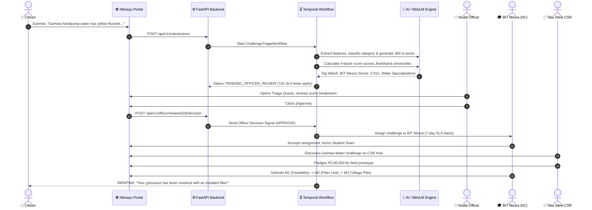

# Nitivayu — Comprehensive User Manual & Operations Guide

**Crowdsourced Societal Challenge & Civic Innovation Pipeline (Jharkhand)**  
**Problem Statement ID:** SIH26043 | **Theme:** Governance & Administration | **Team:** QuantumQuest

---

## 1. Introduction & Overview

**Nitivayu** bridges the gap between grassroots citizen grievances and academic/industrial problem-solvers across Jharkhand. Unlike traditional grievance helplines that optimize solely for closing complaint tickets, Nitivayu uses a durable, multi-agent AI pipeline to transform civic issues into structured research challenges, matches them with top higher education institutions (BIT Mesra, NIT Jamshedpur, IIT-ISM Dhanbad, CUJ, Ranchi University, XLRI), connects CSR corporate funding, and enforces milestone-driven Service Level Agreements (SLAs).

```
┌─────────────────────────────────────────────────────────────────────────────────────────────┐
│                                   NITIVAYU LIFECYCLE                                        │
│                                                                                             │
│  [ Citizen Intake ] ──► [ AI Extraction & Matching ] ──► [ Officer Verification Gate ]     │
│         ▲                              │                               │                    │
│         │ Live Tracking                ▼                               ▼                    │
│  [ Real-Time SMS/PWA ]   [ 4-Factor Score (Semantic,   [ Approve / Override / Reject ]      │
│                            Theme, Capacity, Geo) ]                     │                    │
│                                                                        ▼                    │
│  [ Impact / Resolved ] ◄── [ 3-Stage Milestones M1-M3 ] ◄── [ University Acceptance & CSR ] │
└─────────────────────────────────────────────────────────────────────────────────────────────┘
```

---

## 2. Quick Launch Guide

### 2.1 Starting Nitivayu on Windows

| Action | Command / File | Purpose |
| :--- | :--- | :--- |
| **One-Time Install** | `installation.bat` | Checks Docker, provisions `.env`, creates output dirs, pre-builds containers. |
| **Start Platform** | `start.bat` | Launches all 5 Docker containers in detached mode and displays links. |
| **Stop Platform** | `stop.bat` | Gracefully stops all services while preserving database and workflow data. |

### 2.2 Core Service Endpoints

* **Citizen & Administrative Web UI:** [http://localhost:3000](http://localhost:3000)
* **FastAPI Backend & Interactive API Docs (Swagger):** [http://localhost:8000/docs](http://localhost:8000/docs)
* **Temporal Workflow Dashboard & State Machine:** [http://localhost:8233](http://localhost:8233)
* **PostgreSQL 16 Vector Database:** `localhost:5432` (`nitivayu_db`)

---

## 3. User Roles & Navigation Quick-Reference

| Role | Primary Route | Key Capabilities |
| :--- | :--- | :--- |
| **Citizen** | `/` & `/track/:token` | Submit civic grievances in Hindi/English/Hinglish; real-time milestone tracking. |
| **Nodal Officer** | `/officer` | Review AI-triaged challenges, verify university routing, approve/reject/override. |
| **Batch Admin** | `/officer/batch` | Trigger batch triage on-demand, configure Cron schedules, stream progress. |
| **University IIC** | `/university` | Accept research challenges, form project teams, submit M1–M3 milestone evidence. |
| **CSR Partner** | `/csr` | Discover university-vetted societal challenges, pledge CSR funding. |
| **System Admin** | `/dashboard` | Monitor real-time worker fleet telemetry, throughput, and query latency. |

---

## 4. Step-by-Step Operating Guide

---

### Role 1: Citizen — Intake & Live Tracking

#### 1. How to Submit a Civic Grievance
1. Open [http://localhost:3000](http://localhost:3000).
2. **Enter Problem Description:** Describe the issue in natural language (Hindi, Hinglish, or English).
   * *Example (Hindi):* `"Garhwa block ke handpump mein fluoride aur peela rang aa raha hai, baccho ke daant kharab ho rahe hain."`
   * *Example (English):* `"Adityapur industrial area toxic effluent is being discharged into Subarnarekha River."`
3. **Select Location:** Either click **"Detect GPS Location"** or pick your **District** and **Block** from the dropdowns.
4. **Attach Evidence (Optional):** Upload a photo or document showing the problem.
5. **Select Language Preference:** Choose Hindi, English, or Hinglish.
6. Click **"Submit Civic Grievance"**.

```
┌───────────────────────────────────────────────────────────┐
│  CITIZEN GRIEVANCE SUBMISSION                             │
├───────────────────────────────────────────────────────────┤
│  Describe the Issue:                                      │
│  ┌─────────────────────────────────────────────────────┐  │
│  │ Garhwa block ke handpump mein fluoride aa raha hai..│  │
│  └─────────────────────────────────────────────────────┘  │
│  District: [ Garhwa           ▼ ]  Block: [ Garhwa Sadar] │
│  Language: (•) Hindi  ( ) Hinglish  ( ) English           │
│                                                           │
│  [ 📷 Upload Photo ]               [ 📍 Detect GPS ]      │
│                                                           │
│  [ 🚀 Submit Civic Grievance ]                            │
└───────────────────────────────────────────────────────────┘
```

#### 2. Tracking Your Grievance
* Upon submission, you will receive an official **Tracking Token** (e.g. `NITIVAYU-2026-JH-8831`).
* Navigate to `http://localhost:3000/track/NITIVAYU-2026-JH-8831` or enter the token in the tracker bar.
* Watch the live visual timeline update through stages:
  1. **Ingested** $\rightarrow$ 2. **AI Triaging** $\rightarrow$ 3. **Officer Review** $\rightarrow$ 4. **Routed to University** $\rightarrow$ 5. **Milestone R&D** $\rightarrow$ 6. **Field Solution Implemented**.

---

### Role 2: Government Nodal Officer — Triage Queue & Verification

Nodal officers hold the ultimate governance authority. AI provides recommendations; officers approve or override.

#### 1. Accessing the Review Queue
1. Log in or navigate to [http://localhost:3000/officer](http://localhost:3000/officer).
2. The high-density table displays all submissions with status `PENDING_OFFICER_REVIEW`.

#### 2. Reviewing a Challenge
For each entry, review the AI-extracted intelligence:
* **Category:** (Water, Environment, Infrastructure, Health, Education, Livelihood, Energy, Agriculture, Sanitation, Governance)
* **Severity Badge:** `1/5` (Low) to `5/5` (Critical / Hazardous)
* **Top Matched University & Score:** Calculated using the 4-factor explainable formula:
  $$\text{Score} = 0.60 \cdot S_{\text{semantic}} + 0.20 \cdot S_{\text{theme}} + 0.10 \cdot S_{\text{capacity}} + 0.10 \cdot S_{\text{geo}}$$
* **SLA Countdown Timer:** Enforces the 72-hour review window before auto-escalation.

```
┌─────────────────────────────────────────────────────────────────────────────────────────────────┐
│ ID        Title & Summary                   District   Severity  Top Match (Score)   SLA Timer  │
├─────────────────────────────────────────────────────────────────────────────────────────────────┤
│ #JH-8831  Fluoride in Handpumps (4 villages) Garhwa     🔴 5/5    BIT Mesra (0.912)   ⏳ 68h 12m │
│                                                                  [ Approve ] [ Reject ] [ ⚙ ]   │
└─────────────────────────────────────────────────────────────────────────────────────────────────┘
```

#### 3. Taking Action on a Challenge
* **To Approve:** Click **"Approve"** $\rightarrow$ Confirms the top-matched university and forwards the challenge.
* **To Override University:** Click the **Settings/Override (⚙)** icon $\rightarrow$ Select an alternative university (e.g. override to NIT Jamshedpur or CUJ) and enter verification comments.
* **To Reject / Flag Duplicate:** Click **"Reject"** $\rightarrow$ Select reason (Non-actionable, False report, Duplicate).
* **Keyboard Shortcuts:**
  * `j` / `k` — Navigate rows down / up
  * `a` — Approve highlighted row
  * `r` — Reject highlighted row
  * `x` — Toggle selection for Bulk Approval

---

### Role 3: University IIC Portal — Acceptance & 3-Checkpoint Milestones

Higher education institutions (BIT Mesra, NIT Jamshedpur, IIT-ISM Dhanbad, CUJ, Ranchi University, XLRI) manage matched civic research projects here.

#### 1. Accepting a Research Challenge
1. Navigate to [http://localhost:3000/university](http://localhost:3000/university).
2. Review new assignments in the **Academic Inbox** (e.g., Match Score, Problem Description, District).
3. **7-Day SLA:** The institution has **7 days** to accept. If unaccepted within 5 days (48h warning), an alert is sent; after 7 days, Temporal automatically reroutes the problem to the next-ranked university.
4. Click **"Accept Challenge"** and complete the Team Formation form:
   * **Faculty Mentor Name:** (e.g. *Dr. A. K. Sinha, Dept of Environmental Engg*)
   * **Student Lead Name:** (e.g. *Rohan Kumar, Final Year B.Tech*)
   * **Team Members:** (Add student names / emails)

#### 2. Progressing Through Research Milestones
Once accepted, projects move through **3 structured checkpoints**:

```
┌─────────────────────────┐     ┌─────────────────────────┐     ┌─────────────────────────┐
│      MILESTONE 1        │     │      MILESTONE 2        │     │      MILESTONE 3        │
│   Feasibility Study     │────►│    Working Prototype    │────►│    Field Validation     │
│ (Sample testing & spec) │     │ (Filter unit / MVP app) │     │ (Village trial & data)  │
└─────────────────────────┘     └─────────────────────────┘     └─────────────────────────┘
```

1. Select the active project card.
2. Under the active milestone (e.g., **M1: Feasibility Report**), click **"Submit Evidence"**.
3. Provide the **Document URL / GitHub Repo / Lab Test Report URL** and summary notes.
4. Click **"Mark Milestone Submitted"**.

---

### Role 4: CSR Industry Portal — Funding Societal Challenges

Corporates (Tata Steel, CCL, BCCL, Adani Foundation, Vedanta) can discover and fund verified university projects.

1. Navigate to [http://localhost:3000/csr](http://localhost:3000/csr).
2. **Filter Opportunities:** Filter by Sector (Water, Mining Remediation, Tribal Livelihoods, Green Energy) or District.
3. Review the **University Team**, **Problem Impact**, and **Estimated Budget**.
4. Click **"Pledge Funding"**:
   * Enter **Corporate Name** and **Contact Email**.
   * Enter **Pledged Amount in INR** (e.g. `₹5,00,000`).
   * Select funding phase (Full project, Prototype grant, or Field testing grant).
5. Click **"Confirm Pledge"** $\rightarrow$ A funding link record is generated and recorded in `/output/csr/`.

---

### Role 5: Admin & Batch Triage Control

Manage macro-cadence processing, cross-district clustering, and reporting.

1. Navigate to [http://localhost:3000/officer/batch](http://localhost:3000/officer/batch).
2. **View Active Schedule:** Shows active cadence (Continuous Real-Time, Weekly Cron on Mondays at 00:00 UTC, Monthly Macro on 1st of month).
3. **Trigger On-Demand Batch Triage:**
   * Click **"Run Batch Triage Now"**.
   * Watch live execution progress via Server-Sent Events (SSE):
     * *Step 1: Ingesting unprocessed intake*
     * *Step 2: Generating 384-d MiniLM multilingual embeddings*
     * *Step 3: Cross-district agglomerative clustering*
     * *Step 4: Global university load balancing*
     * *Step 5: Generating IO-compliant CSV and PDF reports*

---

### Role 6: Live Telemetry & System Scalability Dashboard

Inspect live system health and throughput metrics.

1. Navigate to [http://localhost:3000/dashboard](http://localhost:3000/dashboard).
2. Monitor real-time gauges:
   * **Active Temporal Workers:** Healthy worker fleet count.
   * **Queue Lag:** Average latency before activity pickup ($< 0.05\text{s}$).
   * **MiniLM Embedding Inference:** CPU latency ($\sim 45\text{ms}$).
   * **OpenRouter Token RPM & LLM Cache Hit Rate:** Measures API cost-efficiency ($\sim 90\%+$ hit rate).
   * **Submissions Breakdown:** Visual charts categorized by district, theme, and severity.

---

## 5. Output Files & Compliance Reports (`/output/`)

All generated reports and rolling logs are saved in the mounted `./output/` directory:

| Directory & File Pattern | Format | Frequency | Description |
| :--- | :--- | :--- | :--- |
| `output/triage/Nitivayu_triage_<YYYYMMDD>_<HHMMSS>.csv` | CSV (UTF-8 BOM) | Per Batch Run | Complete triage snapshot: extraction, severity, top 3 university matches and scores. |
| `output/sla/Nitivayu_sla_log_<YYYYMMDD>.csv` | CSV (Append) | Daily | Log of all SLA warnings, escalations, and auto-reroute actions. |
| `output/reports/Nitivayu_routing_report_<YYYYMMDD>.pdf` | PDF | Weekly | Department of Higher Education briefing: executive summary, leaderboard, SLA compliance. |
| `output/audit/Nitivayu_audit_<YYYYMMDD>.jsonl` | JSONL (Append) | Daily | Immutable audit trail for every officer approval, rejection, and override. |
| `output/csr/Nitivayu_csr_matches_<YYYYMMDD>_<HHMMSS>.xlsx` | XLSX | Monthly / On-demand | Industry funding matrix matching corporate focus areas to academic projects. |

---

## 6. End-to-End Walkthrough Scenario

Here is an example demonstrating the full lifecycle of a problem:



---

## 7. Troubleshooting & FAQ

### Q1: `docker compose` or `start.bat` reports port conflict on 5432 or 8000
* **Cause:** A local PostgreSQL or web server is already using port 5432, 8000, 3000, or 8233.
* **Fix:** Stop the local PostgreSQL/service or edit `docker-compose.yml` to change the external port mapping (e.g. `"5433:5432"`).

### Q2: How does the AI work if I don't have an OpenRouter API key?
* **Answer:** Nitivayu has a built-in deterministic fallback cache (`LLM_CACHE=1` in `.env` and `backend/app/cache/llm_cache.json`). It will immediately resolve all standard and seeded civic challenges even without an external API key or internet connection.

### Q3: How do I re-seed the sample universities and civic challenges?
* **Answer:** Run the seeding script inside the backend container:
  ```bash
  docker compose exec backend python -m scripts.seed_data
  ```

### Q4: How do I inspect the live Temporal workflow execution tree?
* **Answer:** Open [http://localhost:8233](http://localhost:8233) in your browser. You can click on any active `ChallengeTriageWorkflow`, `WeeklyBatchTriageWorkflow`, or `UniversitySLAWorkflow` to inspect pending activity timers, inputs, outputs, and retry histories visually.

### Q5: How do I cleanly reset the database?
* **Answer:**
  ```cmd
  stop.bat
  docker compose down -v
  start.bat
  ```

---

*Nitivayu — Empowering Citizens, Engaging Academia, Enriching Governance.*
